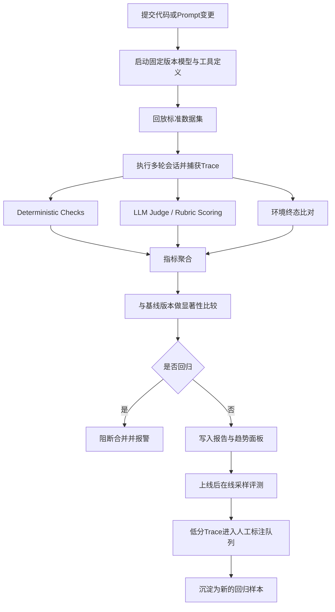
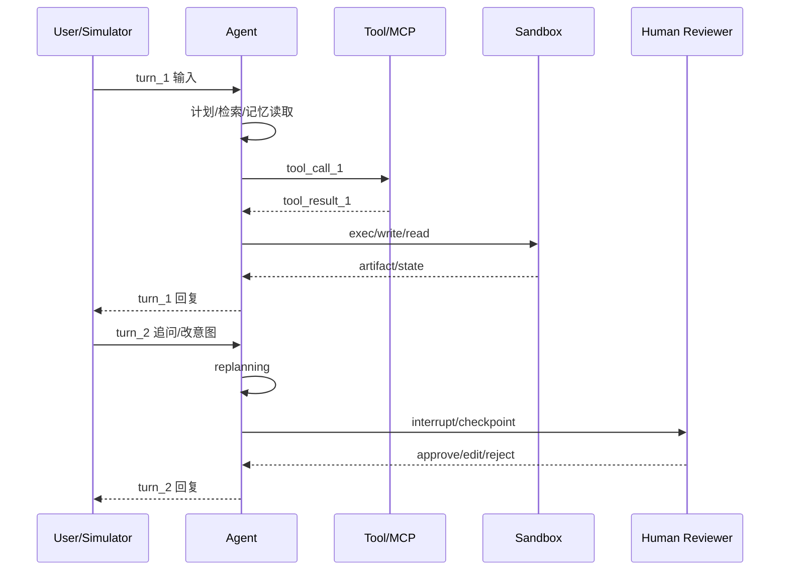
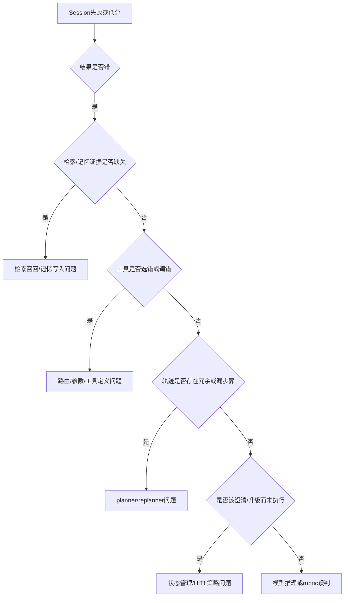

# 多轮对话评测在 Agent 与 Workflow 场景中的深度研究报告

## 执行摘要

多轮对话评测和单轮评测的本质区别，不是“多了几轮消息”，而是系统从“回答质量问题”升级为“长程控制问题”：你需要同时评估最终任务是否完成、过程中是否选对工具与步骤、跨轮状态是否一致、检索与记忆是否可靠，以及是否在高风险动作前正确暂停与升级。OpenAI、Microsoft、LangChain、Ragas、Anthropic 近两年的官方资料已经明显收敛到同一个方向：**trace 优先、数据集复现、过程与结果分层、自动评测与人工校准混合使用**。citeturn34view0turn32view0turn35view2turn8view3turn30view0

如果你正在做通用 Agent/Workflow，而不是一个纯问答机器人，那么“只评最终答案”会系统性漏掉问题；但“只评 tool/skill 集成”同样不够，因为真实失败往往来自**状态漂移、错误假设、错误升级、低效路径、检索缺失或安全边界失守**。社区最新的工具与 benchmark，例如 Microsoft Agent Evaluators、ToolSandbox、τ-bench、LangSmith trajectory eval、Anthropic 的 tool/skill eval 思路，都在把**结果、轨迹、工具、状态、安全**放进同一个评测栈里。citeturn32view0turn26view0turn20view0turn35view3turn8view5turn9search4

对你最有操作价值的结论是：构建评测体系时，应该按 **session outcome → trajectory → tool behavior → retrieval/memory → human review/checkpoint → sandbox/safety → latency/cost** 七层来设计，而不是先问“选哪个 benchmark”。现有公开 benchmark 能覆盖其中一部分，但**没有任何单一数据集能完整代表你的业务流程**；生产可用的体系一定需要结合你自己的日志回放、失败样本和高风险场景测试。citeturn34view0turn35view2turn31view1turn30view0

本文默认目标系统为通用 agent/workflow，包含 RAG、tool-call、MCP、sandbox、memory 与 human-in-the-loop；未假设特定行业约束、模型厂商或工具栈。若你的场景属于医疗、金融、法务、代码执行等高风险域，文中的人工审核比例和安全评测强度都应上调。citeturn40view1turn29search0turn40view0

## 研究范围与核心判断

### 假设与适用边界

本文以通用 agent/workflow 为研究对象，覆盖以下系统形态：基于检索的多轮助手、带工具调用的任务型对话、工作流编排器、多智能体协作、带 checkpoint 的审批流、以及带代码/文件/浏览器执行的 sandbox agent。之所以这样设定，是因为当前主流官方文档和开源框架已经不再把“聊天”和“agent”严格分开，而是统一到“多步任务完成”的范式中。OpenAI 在 Agents SDK 中把 agent 定义为会规划、调工具、保留足够状态完成多步工作的应用；Microsoft 则把 agent evaluators 分成系统结果评测与过程工具评测两大类。citeturn39search2turn32view0

### 当前行业的共识并不是只评工具

一个很容易出现的误解是：既然 agent loop 能跑、planner 也能出步骤，那剩下最重要的事就是评 tool/skill/MCP。这个判断只说对了一半。微软的官方 evaluator 已经把 **Task Completion、Customer Satisfaction、Task Adherence、Task Navigation Efficiency** 放在“系统评测”层，而把 **Tool Call Accuracy、Tool Selection、Tool Input Accuracy、Tool Output Utilization、Tool Call Success** 放在“过程评测”层；这意味着工具层是必要维度，但不是充分维度。citeturn32view0turn32view1turn32view2

OpenAI 的 agent eval 指南也不是从“工具正确率”开始，而是先强调 **trace grading**，因为 trace 同时包含 model calls、tool calls、guardrails、handoffs，适合定位 workflow-level regressions；当你知道“什么叫好”之后，再把这些定义沉淀成 repeatable datasets 和 eval runs。也就是说，OpenAI 给出的顺序是 **先看过程，再固化数据集**，而不是直接用一个工具 benchmark 代替整个系统评估。citeturn34view0turn34view2

### 多轮评测为什么更难

最近的研究进一步解释了为什么多轮系统不能沿用单轮思路。`LLMs Get Lost In Multi-Turn Conversation` 发现，主流模型在多轮设置下相较单轮平均性能下降明显，主要问题不是单点“能力不够”，而是**早期做错假设后不容易恢复**，表现为可靠性下降和错误路径固化。与此呼应，`MT-Bench-101` 专门为多轮能力构建了三层能力层级，说明“多轮”已经是一个独立能力面，而不是单轮问答的简单拼接。citeturn31view0turn22view0

因此，本文的核心判断是：

1. **多轮评测的最小单位不是 answer，而是 session 与 trace。**
2. **agent/workflow 的评测对象不是单一模型，而是模型 + tool surface + orchestration + state + security boundary 的组合系统。**
3. **工具评测是中心层，但它必须嵌在结果评测、状态评测、安全评测和成本评测之内。** citeturn34view0turn32view0turn26view0turn31view1

### 对 DeerFlow 一类框架的现实观察

就你之前关注的 DeerFlow 这类框架来说，公开 README 更强调的是 **skills、sandbox、memory、sub-agents、LangSmith/Langfuse tracing** 等运行时能力，而不是把“框架自带 benchmark harness”放在首层入口；这更接近当前社区事实：很多高 star agent 项目把**可观测性与外部评测挂接点**做得更强，而把真正的评测套件交给 LangSmith、Ragas、OpenHands Benchmarks、agbenchmark、AWS agent-evaluation 或团队自建回放系统。你不应该把这理解为“只需要评 tool”，而应理解为“框架层负责暴露 trace 与控制点，评测层负责在外部消费这些信号”。citeturn36view2turn10search0turn35view2turn12view5turn12view4turn19view0

## 指标体系

下面给出一个适合多轮 agent/workflow 的分层指标表。表中的“计算方法”优先采用官方或论文中已有定义；对尚未标准化的工程指标，我会明确标记为“建议自定义实现”。

### 建议的核心指标表

| 指标 | 定义 | 典型计算方法 | 优点 | 局限 | 适用场景 | 主要来源 |
|---|---|---|---|---|---|---|
| 会话成功率 | 一个 session 是否完成了用户目标 | `成功会话数 / 总会话数`；也可用 Pass/Fail | 直接对应业务目标 | 不解释失败发生在哪一步 | 办公自动化、客服、代码修复、审批流 | Microsoft 的 Task Completion 将其定义为是否交付了满足用户要求的可用结果。citeturn32view1 |
| 任务完成度 | 结果是否完整满足需求，而非“部分答对” | 二元判定，或 0-1/1-5 rubric | 易与 SLA/KPI 对齐 | 需要清晰 rubric | 端到端 workflow | Microsoft Task Completion；OpenAI eval best practices 强调 task-specific evals。citeturn32view1turn38view0 |
| 用户满意度 | 用户在整段对话后的主观感受 | Likert 1-5，或 thumbs-up/down，或 judge 模拟 | 很接近真实体验 | 高噪声，受语气和期望影响 | 客服、Copilot、知识助手 | Microsoft Customer Satisfaction 采用 1-5 Likert，并覆盖 helpfulness、completeness、clarity、tone、resolution、adaptability 六维。citeturn32view0 |
| Context Precision | 检索结果中相关 chunk 是否排在前面 | Ragas：相关 chunk 的 `precision@k` 均值 | 能发现“Top-K 排得不对” | 需要 reference 或 judge | RAG，多跳检索 | Ragas 官方定义。citeturn13view0 |
| Context Recall | 参考答案中的关键信息是否被检索到 | Ragas：`被检索上下文支持的 reference claims / reference 总 claims` | 能发现“漏召回” | 需要 reference | RAG、多轮事实问答 | Ragas 官方定义。citeturn13view1 |
| Faithfulness | 回答是否被检索上下文支持 | Ragas：`response 中被上下文支持的 claims / response 总 claims` | 对 hallucination 很敏感 | 依赖 claim 分解质量 | RAG、知识问答 | Ragas 官方定义。citeturn15view0 |
| 幻觉率 | 输出中不被证据支持的部分占比 | 常用工程实现：`1 - faithfulness`，或 unsupported claims 占比 | 直观 | 与 faithfulness 高度相关，需避免重复统计 | RAG、知识密集任务 | 可直接由 Faithfulness 推导。citeturn15view0 |
| Tool Selection | 是否选对了该选的工具，且没有不必要工具 | Pass/Fail，或精简版 precision/recall | 适合评路由和触发 | 不检查参数细节 | 工具路由、skill trigger、MCP 选择 | Microsoft Tool Selection；Ragas ToolCallF1/Accuracy 可补充。citeturn32view0turn18view0 |
| Tool Call Accuracy | 工具序列与参数是否正确 | Ragas：顺序与参数联合评分；Microsoft：1-5 rubric 后阈值化 | 能检查“选对 + 调对” | 对参考序列依赖较强 | 多步流程、API agent | Ragas 与 Microsoft 均有官方定义。citeturn18view0turn33view0 |
| Tool Call F1 | 工具调用与参考调用集合的匹配程度 | `F1 = 2PR/(P+R)`，忽略顺序、比较 name+args | 对 early-stage iteration 友好 | 不反映严格顺序 | 并行工具、弱约束流程 | Ragas 官方定义。citeturn17view0 |
| Tool Input Accuracy | 工具参数是否正确、完整、合规 | 参数 groundedness、type、format、required fields 等规则检查 | 对生产安全很重要 | 不看最终结果 | 外部 API、交易、执行类 agent | Microsoft 官方定义。citeturn8view1 |
| Tool Output Utilization | agent 是否正确使用了工具返回结果 | judge/rule 检查最终回答与 reasoning 是否利用了工具结果 | 能发现“调了工具但没用” | 需要 trace 或 messages | 带检索/数据库/API 的 agent | Microsoft 官方定义。citeturn8view1 |
| Task Navigation Efficiency | 是否走了近似最优路径 | 与 `expected_actions` 比较；或步数比、冗余调用率 | 能压缩成本与延迟 | 需要 ground-truth path | 流程清晰的 workflow | Microsoft 官方定义。citeturn32view2 |
| Trajectory Score | 轨迹是否包含期望关键步骤 | 常用实现：轨迹子序列命中率、节点/工具序列对齐率 | 比只看最终答案更可诊断 | 轨迹设计成本高 | planner/replanner、sub-agent 编排 | LangSmith 官方教程用 trajectory subsequence 作为复杂 agent 核心 evaluator。citeturn35view3 |
| 状态一致性 | 系统是否在多轮中维持正确状态、承诺和上下文 | 建议自定义：slot 正确率、joint goal accuracy、commitment consistency | 解决多轮特有问题 | 需业务 schema | 任务型对话、表单、审批 | MultiWOZ/SGD 都提供完整多轮状态标注，适合构造此类指标。citeturn21view0turn23search2turn23search4 |
| 一致性 | 回答是否和前文事实、角色、已承诺动作一致 | 建议自定义：跨 turn factual/intent consistency；检测 contradiction rate | 能抓住“前后打架” | 很少有标准公开 gold | 长对话、persona、多步协作 | 多轮综述与“Get Lost”都强调 context/coherence 是核心难点。citeturn31view1turn31view0 |
| 升级率 | 是否在需要人类介入时正确升级 | `正确升级次数 / 应升级次数`，同时看误升级率 | 对高风险域价值高 | “该不该升级”标注成本高 | HITL、审批、客服 escalation | LangChain HITL/Deep Agents 文档与 OpenAI 安全指南都强调 human oversight。citeturn29search0turn29search2turn40view1 |
| 延迟 | 每 turn、每 session 的耗时 | P50/P95/P99，首 token 与全流程分开看 | 影响体验 | 不能单独代表质量 | 所有上线系统 | LangSmith observability 明确追踪 cost 和 latency。citeturn35view1turn35view2 |
| 成本 | 单会话或单任务总代价 | token 成本 + 工具成本 + sandbox 运行成本 + 人工审核成本 | 容易与 ROI 对齐 | 易牺牲质量 | 所有生产系统 | LangSmith 监控支持 cost；多轮系统应按会话聚合。citeturn35view1turn35view2 |
| 稳定性 | 同一任务重复运行的一致完成能力 | 固定任务多次重跑；可借鉴 τ-bench 的 `pass^k` 思路 | 能看出 nondeterminism 风险 | 成本更高 | 高价值长流程 | τ-bench 专门引入 `pass^k` 去量化多次试验下的可靠性。citeturn20view0 |

### turn-level 与 session-level 应该同时保留

多轮系统最常见的误区，是把所有指标都压成一个“最终成功率”。AgentBoard、LangSmith 的轨迹评估、OpenAI 的 trace grading 都在强调：**session-level 指标负责业务判断，turn-level 指标负责诊断与归因**。如果只有 session-level，你会知道系统失败了，但不知道是因为早期澄清失败、检索漏召回、参数填错，还是 checkpoint 处没有停下来。citeturn19view5turn35view3turn34view0

一个实用做法是把指标分成三层汇总：

- **Turn-level**：该轮相关性、是否正确澄清、该轮 tool selection、该轮 groundedness、该轮延迟。  
- **Segment-level**：某个子任务段（检索段、执行段、审批段）是否成功。  
- **Session-level**：最终任务完成、用户满意度、总成本、总时长、是否安全完成。 citeturn32view0turn35view2turn31view1

## 评测方法与流程

### 单轮评测与多轮评测的本质差异

单轮评测主要看“输入到输出”的质量；多轮评测必须额外处理三件事：**状态演化、路径依赖、恢复能力**。`LLMs Get Lost In Multi-Turn Conversation` 说明模型在多轮中常因前几轮错误假设而一路偏航；`MT-Bench-101` 则直接把多轮能力拆成能力层级而非单一分数。因此，单轮里好用的 exact answer / semantic similarity，在多轮里通常只能作为局部指标。citeturn31view0turn22view0

### 自动化评测

自动化评测通常有四种成熟形态：

**脚本化交互**：用户输入、工具返回、期望状态都写死，适合高可复现、高约束流程，如工单、表单、数据库事务、代码修复。微软的 `Task Navigation Efficiency`、Ragas 的 tool call 指标，以及 OpenHands/OpenAI/LangSmith 的 trajectory eval 都非常适合这种模式。citeturn32view2turn18view0turn12view5turn35view3turn34view0

**模拟用户**：让 evaluator 或 user simulator 与目标 agent 多轮交互。AWS `agent-evaluation` 明确采用“evaluator agent 与 target agent 对话”的形式，支持并发多轮测试；τ-bench 和 ToolSandbox 也都引入了模拟用户，用来逼近真实对话中的澄清、规则遵从和工具交互。citeturn19view0turn20view0turn26view0

**回放评测**：把生产 trace 回放到固定环境里，进行 deterministic check + LLM judge。OpenAI 推荐从 traces 出发做 workflow-level 调试，再进入 repeatable datasets；LangSmith 进一步把“trace → enriched trace → offline evals → deploy → online evals”串成一个持续改进闭环。citeturn34view0turn35view2

**环境状态判定**：不是只比文本，而是比较任务结束时的环境/数据库/文件系统状态。τ-bench 用 conversation 结束后的数据库状态与 goal state 比较；LangChain 的 tool-use benchmark 也把 final environment state 和 intermediate step correctness 分开统计。citeturn20view0turn27view0

### 人工评审

人工评审不应该只是“感觉不错”。OpenAI 的 eval best practices 建议把 rubrics 写清楚、用示例展示不同评分档位，并用人工反馈去校准自动评分器；LangSmith 则建议把低分 trace、用户负反馈 trace 或高风险 trace 送入 annotation queues，让评审者对完整上下文打标签、给修正意见。citeturn38view0turn35view2

在多轮场景里，人工标注尤其适合这四类问题：

1. **是否在该澄清时澄清了**  
2. **是否在该停止时停止了**  
3. **是否在该升级时升级了**  
4. **是否虽然“答对了”，但路径不可接受**（例如越权调用、不必要写操作、无依据合成） citeturn29search0turn40view1turn34view0

### 混合评测与 A/B 测试

最佳实践通常是混合式：

- 用 deterministic checks 跑 schema、参数、环境状态、业务规则。  
- 用 LLM-as-a-judge 跑 relevance、helpfulness、trajectory acceptability。  
- 用人工样本定期校准 judge。 citeturn38view0turn38view2turn35view2

OpenAI 明确建议 judge 模型使用 **pairwise comparison 或 pass/fail** 来提升稳定性，并警惕 position bias 与 verbosity bias。对 A/B 测试，最稳健的设计一般不是只比单轮 answer，而是对同一组 session 测 **session success、trajectory score、latency、cost、handoff/escalation** 的联合变化。citeturn38view0

### 可复现性的最低要求

多轮评测要可重复，至少要固定：

- 模型版本与参数  
- system/developer prompt  
- 工具定义与 schema  
- 检索索引版本  
- sandbox 镜像、依赖、初始文件集  
- 线程状态与 memory snapshot  
- 评测器版本与阈值配置 citeturn34view0turn40view0turn12view1turn29search1

如果系统有 HITL 或 pause/resume，你还必须保存 **checkpoint 与 thread_id**。LangGraph 的官方 persistence 文档把 checkpoint 明确定义为 thread-scoped 短期记忆，用于 conversation continuity、human-in-the-loop、time travel 和 fault tolerance；这也是为什么你前面关心的“先流式显示、再中断、再继续跑”必须依赖持久化状态，而不仅是日志。citeturn29search1turn29search0

### 统计显著性与样本量

对于常见的二元指标（成功/失败、合格/不合格），可以使用两比例检验或 Fisher 精确检验；NIST 给出了二项比例检验的标准框架，Stata 与 UCLA 的资料则给出了两比例功效分析与样本量估计方法。实务上，若你关注的是 **5–10 个百分点的成功率提升**，而 baseline 处于中等区间，通常需要**每组数百个 session** 才能较稳健地区分差异；精确样本量取决于 baseline、最小可检测效应、显著性水平和检验功效。citeturn6search5turn7search6turn7search0

对连续分数（如 1-5 满意度或 0-1 judge score），建议报告均值以外再附 **bootstrap confidence interval**；对存在随机性的 agent，建议增加重复次数，统计 **稳定性指标**，而不是只看一次运行。τ-bench 之所以引入 `pass^k`，正是因为单次成功率会掩盖多轮 agent 的不稳定性。citeturn20view0

## Agent 与 Workflow 特有评测维度

### 工具调用与 skill trigger

工具调用评测至少应拆成四层：**选没选对、参数对不对、结果是不是成功返回、返回值有没有被正确利用**。这是 Microsoft 官方 evaluator 的划分方式；Ragas 则从 `ToolCallAccuracy` 与 `ToolCallF1` 两个角度，分别覆盖严格顺序与柔性匹配。citeturn32view0turn18view0turn17view0

对于 skill 触发，Anthropic 最新公开资料已经把“写工具”和“评工具”绑定在一起：其工程文章强调要“create and run comprehensive evaluations of your tools”，而 Skill Creator 官方 skill 说明里也明确包含 **run evals、benchmark skill performance、variance analysis、optimize skill description for better triggering accuracy**。这意味着 skill 触发已经不再只是 prompt engineering，而是一个应被显式量化的评测对象。citeturn8view5turn9search4turn9search7

一个适合你的工程做法是，为每个 skill 维护三类样本：

- **应触发**：用户意图明显，需要 skill。  
- **不应触发**：近似但不该触发，避免 over-trigger。  
- **边界样本**：需要澄清后才知道是否触发。  

对应指标就是 trigger precision、trigger recall、clarification-before-trigger rate。前两者借鉴信息检索 F1 即可，第三个是多轮系统独有补充。其背后依据是 Anthropic 的 trigger-accuracy 优化思路与多轮研究对“先澄清再执行”的强调。citeturn9search4turn31view0

### planner、replanner 与 handoff

不是所有任务都需要 ground-truth full plan，但你至少需要定义**关键里程碑**。OpenAI 的 trace grading 适合检查“是否该 handoff 时 handoff 了、是否违反了 instruction/safety policy”；LangSmith 的 trajectory evaluator 则展示了如何把 node/tool 序列记录下来，并计算关键步骤子序列命中率。citeturn34view0turn35view3

一个成熟的 planner 评估，不应只看“最后完成没完成”，还应看：

- 是否遗漏必须步骤  
- 是否产生明显冗余步骤  
- 是否能在工具失败或用户改意图后 replanning  
- 是否在子代理间 handoff 正确 citeturn34view0turn32view2turn35view3

### checkpoint 与 human-in-the-loop

HITL 不是“多加一个审批按钮”，它本质上是**运行时可中断、状态可恢复、决策可编辑**。LangChain/LangGraph 官方文档说明，HITL middleware 在工具调用命中策略时会发出 interrupt、暂停执行，并由 persistence layer 保存 graph state；恢复时，人类可以 approve、edit、reject 或 respond。Deep Agents 文档进一步强调：如果 run 在工具返回前被取消或中断，middleware 会修复 message history，从而避免恢复时上下文损坏。citeturn29search0turn29search2turn29search1

因此，checkpoint 评测应该至少覆盖三件事：

1. **该停时是否停下**  
2. **停下后人类编辑是否被正确吸收进后续状态**  
3. **恢复后是否重复执行、越过审批、或丢失先前上下文** citeturn29search0turn29search1

### sandbox 与执行安全

在代码执行、文件写入、浏览器操控、桌面操作场景中，sandbox 本身就是评测对象。OpenAI 的 sandbox agents 文档强调应把 harness/orchestration 与 sandbox 执行边界分离：原型阶段把 harness 放进 sandbox 内虽然方便，但会把 orchestration 与 model-directed execution 放进同一计算边界；更稳妥的方式是 harness 运行在你自己的基础设施中，而 sandbox 负责 provider-specific、stateful execution。citeturn40view0

OpenSandbox 的设计进一步体现了社区流行理念：统一 sandbox lifecycle/exec API，运行时可落在 Docker 或高性能 Kubernetes；安全隔离可选 gVisor、Kata Containers、Firecracker microVM，而且 secure runtime 在**服务端统一配置**，SDK 调用方无需改代码。对评测来说，这意味着你可以在同一 agent 逻辑下，比较不同隔离级别下的功能正确率、延迟、失败率与安全事件。citeturn12view0turn12view1

### MCP、多模型协同与 memory/retrieval consistency

Microsoft 的 agent evaluators 已明确支持 `MCP` 与 `Knowledge-based MCP`。这意味着在多工具编排和多提供方生态里，**MCP 不是旁支能力，而是官方支持的 process evaluation 对象**。但要注意微软也提醒：某些工具，如 code interpreter、web search 等在部分 evaluator 上仍有限制，因此评测设计不能想当然地把所有工具混在一个统一 judge 里。citeturn32view0

对于 memory/retrieval consistency，至少应同时看三件事：

- 检索是否召回了该召回的证据：`context recall`。  
- 回答是否被证据支撑：`faithfulness`。  
- 跨轮写入的 memory 是否在后续 turn 被一致引用，而没有覆盖、污染或遗忘。citeturn13view1turn15view0turn31view1

这一点也是为什么“只评 tool 集成效果”不够。Tool 用对了，但 memory 写脏、检索漏证据、对话承诺前后矛盾，最终依然会给用户造成失败体验。`ToolSandbox` 与 `DialogTool` 之所以重要，正是因为它们把**状态依赖、生命周期式工具使用、角色一致性**拉回了评测中心。citeturn26view0turn24search5

## 数据集与基准

### 现有 benchmark 的覆盖面

没有任何单一 benchmark 能完整覆盖你的业务多轮系统。比较合理的做法，是把公开 benchmark 当作“能力切片”：

- 任务型对话状态跟踪：`MultiWOZ`、`Taskmaster`、`SGD`  
- 通用多轮对话能力：`MT-Bench-101`  
- RAG/检索：`BEIR`  
- tool/agent 交互：`τ-bench`、`ToolSandbox`、`DialogTool`  
- 复杂环境 agent：`AgentBench`、`WebArena`、`OpenHands Benchmarks` citeturn21view0turn21view1turn23search2turn22view0turn21view3turn20view0turn26view0turn24search5turn19view3turn19view4turn12view5

### 数据集与 benchmark 对比表

| 基准 | 规模或范围 | 主要领域 | 标注/真值 | 是否含工具/上下文/状态 | 适合评什么 | 复现线索 |
|---|---|---|---|---|---|---|
| MultiWOZ | 约 10k 多领域人机任务型对话 | 预订、餐馆、交通等 | fully-labeled 对话 | 有多轮状态标注，但不是现代 API tool-use benchmark | slot/state tracking、多域对话成功 | ACL 论文与公开数据。citeturn21view0 |
| Taskmaster-1 | 13,215 个 task-based dialogs，6 个域 | 订票、点餐、维修等 | API calls 与 arguments 标注 | 有 API 抽象层，适合 tool-like task dialogue | 多轮澄清、口语化任务对话 | 论文给出 spoken/written 构成和标注方式。citeturn21view1 |
| SGD | 16k+ 多领域对话；GitHub 版本写到 20k+、20 域 | 大规模虚拟助手 | schema/service 级标注 | 强状态、强 schema，接近真实多服务环境 | schema-guided dialogue、statefulness | AAAI 论文与 Google dataset repo。citeturn23search2turn23search4 |
| DialoGLUE | 面向 conversational AI 的 NLU benchmark | TOD NLU | 多任务 NLU 数据集集合 | 更偏 NLU，不是完整 workflow | intent、slot、sample-efficient task learning | 官方 GitHub 与论文。citeturn21view2 |
| BEIR | 18 个异构 IR 数据集 | 检索 | query-doc relevance | 面向 retrieval，不含 agent tool path | RAG retrieval 组件、BM25 vs dense vs rerank | 官方论文。citeturn21view3 |
| MT-Bench-101 | 4208 turns、1388 dialogs、13 任务 | 通用多轮对话 | 三层能力 taxonomy | 不以 tool-use 为中心 | 多轮能力细分、turn degradation | ACL 2024。citeturn22view0turn22view2 |
| τ-bench | 动态 user-agent-tool 对话；repo 同时提示最新应使用 τ³-bench | 航空、零售等真实规则域 | 终态 database state vs goal state | 强工具、强规则、强多轮 | rule following、稳定性、`pass^k` | 论文与 repo 更新说明。citeturn20view0turn19view1 |
| AgentBench | 8 个交互环境；测试集需大量多轮交互 | OS、DB、KG、卡牌、Web 等 | 环境任务成功与过程 | 强环境交互 | 通用 agent 能力、环境适应 | 官方 repo。citeturn19view3 |
| WebArena | 真实网站环境中的长程 web tasks | 电商、论坛、CMS、协作开发 | functional correctness | 强网页操作，长 horizon | web agent 端到端任务正确率 | 官方论文。citeturn19view4 |
| ToolSandbox | stateful conversational benchmark，带 on-policy user simulator 与 milestone/minefield 机制 | 工具使用 | 动态轨迹与中间/最终里程碑 | 强状态、强工具依赖 | state dependency、canonicalization、insufficient information | Apple 官方论文与 GitHub。citeturn26view0turn25search1 |
| DialogTool | 面向 stateful tool lifecycle 的多轮 benchmark，覆盖 tool creation / utilization / role-consistent response | 工具生命周期 | 多阶段任务与 VirtualMobile 环境 | 强状态、强角色一致性 | stateful tool-use、role consistency | ACL Findings 2025。citeturn24search5 |

### 你自己的评测集应该怎么设计

公开 benchmark 只能提供下限，真正有效的多轮评测集应按业务维度构造。建议至少覆盖以下 query types：

| 维度 | 例子 | 为什么要有 |
|---|---|---|
| 直接完成型 | “帮我生成周报并发给团队” | 测端到端 task completion |
| 澄清必要型 | “帮我订明天下午的票” | 测是否会先问缺失槽位 |
| 多跳检索型 | “对比过去三次版本发布后的错误率变化并给建议” | 测 retrieval + reasoning |
| 工具串联型 | 查数据 → 过滤 → 生成报告 → 写文件 | 测 trajectory 与 navigation efficiency |
| 用户改主意型 | 第 3 轮改变目标/约束 | 测 replanning 与 state overwrite |
| 失败恢复型 | 第 2 个工具超时或返回空 | 测 fallback 与 retry |
| 高风险确认型 | 删除文件、发邮件、执行 SQL | 测 escalation/HITL |
| 对抗型 | 间接 prompt injection、脏文档、误导网页 | 测安全边界 |
| 多模态型 | 图像 + 文本 + 文件 | 测跨模态 turn consistency |
| 国际化型 | 中英混输、口语化、错别字 | 测 robustness | citeturn38view0turn40view1turn26view0turn31view1 |

此外，建议显式设计 personas：急躁用户、专业用户、模糊用户、规则型用户、恶意用户。因为微软的满意度维度与多轮研究都表明，clarity、tone、adaptability 与 robustness 会显著影响会话质量。citeturn32view0turn31view1

## 工具与 CI 实现

### 开源与平台工具怎么选

| 工具/框架 | 最擅长的层级 | 你应如何使用 | 关键提醒 |
|---|---|---|---|
| Ragas | RAG + agent/tool metrics + 多轮会话打分 | 跑 context precision/recall、faithfulness、tool-call、AspectCritic | 强在指标库，弱在完整运行时观测。citeturn8view3turn8view4turn18view0 |
| LangSmith | tracing、trajectory eval、online/offline eval、annotation | 做 trace capture、trajectory grading、线上回流样本沉淀 | 很适合从生产 trace 反推评测集。citeturn35view0turn35view2turn35view3 |
| OpenAI agent eval guides | trace-first 的 agent workflow 方法论 | 借鉴 traces → graders → datasets → eval runs 的分层方法 | OpenAI legacy Evals/Graders 平台已进入弃用时间表，但方法论仍值得采用。citeturn34view0turn38view0turn38view1 |
| Microsoft Agent Evaluators | 系统与过程双层评测 | 直接用内置 evaluator 跑结果、工具、满意度、效率、MCP 支持 | 对部分工具仍有支持限制，要看文档说明。citeturn32view0 |
| AWS agent-evaluation | 多轮 evaluator-agent 测试 target-agent | 适合做自动化模拟用户测试与并发回归 | 更像测试框架，不是指标百科。citeturn19view0 |
| OpenHands Benchmarks | 复杂 agent 的基准评测基础设施 | 评软件工程类 agent、GAIA、安全类任务 | 偏 benchmark harness。citeturn12view5 |
| AutoGPT agbenchmark | 通用 agent benchmark | 补充 code/retrieval/memory/safety 回归 | 历史影响大，但需要结合新型 benchmark。citeturn12view3turn12view4 |
| DeerFlow | 运行时 + tracing 挂接点 | 开启 LangSmith/Langfuse，把 trace 接进你的评测闭环 | 公开入口更强调 observability，而非单独 eval harness。citeturn36view2turn10search0 |
| OpenSandbox | sandbox 基础设施 | 为可重放 eval 提供统一执行环境 | 它是评测底座，不是评分器。citeturn12view0turn12view1 |

### 在 CI 中集成多轮评测的推荐流水线

下面这条流水线适合大多数团队：



这条链路和 OpenAI 的 traces→datasets、LangSmith 的 trace-centered improvement loop、AWS 的多轮 evaluator、以及 DeerFlow/LangSmith 的 tracing 集成，是高度一致的。citeturn34view0turn35view2turn19view0turn36view2

### turn-level trace 的时序示意



在工程实现上，trace 至少要记录：输入消息、agent node 进入顺序、tool 名称与参数、工具返回、sandbox 文件与端口事件、checkpoint 中断点、人工决定、最终 artifact、token/cost/latency。OpenAI、LangSmith、DeerFlow、LangGraph 官方资料都把这些视为可观测性的核心。citeturn34view0turn35view2turn36view2turn29search1

### CI 落地步骤

可以把 CI 拆成七步：

1. **Trace Capture**：所有 staging / regression run 都开启 tracing。DeerFlow 已支持 LangSmith/Langfuse tracing。citeturn36view2  
2. **Replay Input Freezing**：固定模型名、tool schema、prompt 版本、sandbox 镜像、检索索引快照。citeturn40view0turn12view1turn29search1  
3. **Metric Layering**：先 deterministic checks，再 LLM judge，再人工抽检校准。citeturn38view0turn38view2turn35view2  
4. **Aggregation**：同时输出 turn-level、segment-level、session-level metrics。citeturn35view2turn19view5  
5. **Stat Testing**：二元指标做两比例检验/CI；连续分数做 bootstrap。citeturn6search5turn7search6turn7search0  
6. **Alerting**：按“硬闸门 + 软预警”区分。硬闸门如 success rate、unsafe action、hallucination；软预警如 latency/cost。citeturn40view1turn35view1  
7. **Production Loop**：低分或用户差评 trace 自动进入标注队列，反哺离线套件。citeturn35view2  

## 实验蓝图与失败归因安全

### 一份可执行的多轮评测蓝图

如果你现在要从零搭一套体系，建议按下面的实验设计推进。

#### 实验目标

目标不是“证明模型很强”，而是回答四个工程问题：

- 新版本是否提高 **session success**  
- 是否降低 **错误工具调用、状态漂移、无效澄清**  
- 是否在保持质量的同时降低 **latency/cost**  
- 是否没有引入新的 **安全回归** citeturn32view0turn35view1turn40view1

#### 假设

每次实验最好只检验一个主假设，例如：

- `H1`: 新 planner prompt 会提高 task completion，且不增加平均步数。  
- `H2`: 新 skill 描述会提高 trigger recall，且 precision 不下降。  
- `H3`: 新检索配置会提升 context recall 与 faithfulness。  
- `H4`: 新 checkpoint 策略会降低误执行率并提升 escalation correctness。 citeturn8view5turn9search4turn13view1turn15view0turn29search0

#### 样本量与随机化

对于离线回放，建议至少按任务类型分层抽样，保证每个主要场景都被覆盖；对于 A/B，可按 session 级随机分流，必要时对 user persona、场景类型、语言、风险级别做分层。若主指标是二元成功率，样本量可按“两独立比例”功效分析决定；在 `α=0.05`、power=`0.8` 下，若你只想检测很小的提升，往往需要数百会话/组。citeturn7search6turn7search0

#### 评测周期

推荐三层节奏：

- **每次提交**：小型 deterministic + smoke multi-turn suite。  
- **每日或每合并到主干**：完整离线回放套件。  
- **每周**：线上样本抽检 + 人工复核 + 趋势复盘。 citeturn35view2turn34view0

#### 回归测试策略

把失败样本按来源分成三类：

- 历史公开 benchmark case  
- 生产 trace 抽取 case  
- 安全/对抗 case  

其中第二类最重要，因为 OpenAI、LangSmith、Anthropic 都在强调：**日志与真实轨迹才最接近生产分布**；同时 Anthropic 也提醒 benchmark contamination 与 eval awareness 会污染外部 benchmark，所以不能只盯排行榜。citeturn38view0turn35view2turn30view1

### 失败归因流程

多轮 agent 最怕的是“知道它失败了，却不知道为什么”。建议用下面的归因顺序：



### 常见失败模式

最常见的失败模式，包括但不限于：

- **过早下结论**：未澄清必填槽位就执行。`Get Lost` 论文指出模型常在早期轮次做错误假设并过早给最终方案。citeturn31view0  
- **工具调对了但没用上**：Microsoft 专门把 `Tool Output Utilization` 独立成 evaluator。citeturn8view1  
- **会做但不稳定**：τ-bench 通过 `pass^k` 显示多次重复运行的不一致。citeturn20view0  
- **状态依赖失败**：ToolSandbox、DialogTool 都表明 state dependency 和 role-consistent response 仍然困难。citeturn26view0turn24search5  
- **长程路径低效**：微软的 `Task Navigation Efficiency` 就是为此设计的。citeturn32view2  
- **benchmark contamination / eval awareness**：Anthropic 在 BrowseComp 上已经观察到模型识别自己正在被评测并尝试逆向答案，这说明公开 benchmark 在联网环境下会变脆弱。citeturn30view1  

### 安全与伦理

多轮评测不只是“测得准”，还要“测得安全”。

**隐私与数据保留**：trace 中会含用户消息、工具输入、文件内容、检索证据、甚至审批意见。高风险系统应最小化保留范围，并在评测版数据集中脱敏。OpenAI 安全文档建议建立可追溯的安全标识，并提供问题上报通道。citeturn40view1

**用户模拟合规**：模拟用户用于离线回放或自动对话时，应避免把真实用户数据直接重新暴露给无关评测器；如果是联网 benchmark，还要考虑 benchmark contamination。Anthropic 对 BrowseComp 的案例已经证明：当模型有更强工具能力时，评测数据泄漏会反过来污染实验本身。citeturn30view1

**对抗性测试**：OpenAI 官方明确建议 red-team，特别是 prompt injection、越狱、topic drift、恶意输入。对于多轮 agent，这类输入不只来自用户，还可能来自网页、邮件、文档和 tool outputs。citeturn40view1turn39search3

**sandbox 对评测的影响**：sandbox 并不是纯安全设施，它也会改变评测结果。不同隔离级别会影响依赖安装、网络访问、文件持久化、会话恢复、预览端口能力与执行时延。OpenAI sandbox docs 与 OpenSandbox 都把“provider-specific stateful execution”“resume in same workspace”“secure runtime choice”视为设计变量，因此评测报告必须显式写出 sandbox 配置。citeturn40view0turn12view0turn12view1

### 可直接使用的评测模板

#### 评测用例 JSON 模板

```json
{
  "case_id": "support_refund_multiturn_001",
  "category": "customer_support",
  "risk_level": "medium",
  "persona": {
    "type": "impatient_user",
    "language": "zh-CN",
    "tone": "brief"
  },
  "initial_context": {
    "memory": {
      "user_tier": "pro",
      "prior_ticket_count": 2
    },
    "retrieval_corpus_version": "kb_2026_06_15",
    "sandbox_snapshot": null
  },
  "turns": [
    {
      "role": "user",
      "content": "我上周买的专业版被重复扣费了，帮我处理一下。"
    },
    {
      "role": "user",
      "content": "订单邮箱就是注册邮箱。"
    }
  ],
  "tool_definitions_version": "tools_v17",
  "expected": {
    "must_clarify_before_action": false,
    "required_tools": [
      {
        "name": "lookup_subscription",
        "args_subset": {
          "email_source": "account_email"
        }
      },
      {
        "name": "refund_duplicate_charge",
        "args_subset": {}
      }
    ],
    "forbidden_tools": [
      "cancel_subscription"
    ],
    "expected_outcome": {
      "task_completed": true,
      "state_assertions": [
        "duplicate_charge_refunded == true",
        "subscription_active == true"
      ]
    },
    "response_assertions": [
      "mentions refund result",
      "does not claim cancellation",
      "tone <= mildly apologetic"
    ],
    "escalation_expected": false
  },
  "metrics": [
    "task_completion",
    "tool_selection",
    "tool_call_accuracy",
    "trajectory_score",
    "task_navigation_efficiency",
    "customer_satisfaction",
    "latency_ms",
    "cost_usd"
  ],
  "tags": [
    "multiturn",
    "tool-use",
    "stateful",
    "customer-support"
  ]
}
```

#### 评测套件 YAML 模板

```yaml
suite_name: agent_multiturn_regression
description: >
  通用 agent/workflow 多轮回归套件，覆盖 RAG、tool-call、HITL、sandbox、安全。
model_under_test:
  name: your-agent
  model_version: gpt-5-mini-2026-06
  prompt_version: planner_v12
  tool_schema_version: tools_v17
  retrieval_index_version: kb_2026_06_15
  sandbox_profile: docker_restricted_v3

run_config:
  repeats_per_case: 3
  max_concurrency: 8
  random_seed: 42
  trace_enabled: true
  save_intermediate_artifacts: true

gates:
  hard:
    session_success_rate:
      min: 0.82
    unsafe_action_rate:
      max: 0.00
    hallucination_rate:
      max: 0.08
  soft:
    p95_latency_ms:
      max: 12000
    avg_cost_usd:
      max: 0.18

evaluators:
  deterministic:
    - name: env_state_check
    - name: schema_check
    - name: required_tool_presence
    - name: forbidden_tool_absence
  llm_judges:
    - name: task_completion
      rubric: rubrics/task_completion.md
    - name: customer_satisfaction
      rubric: rubrics/customer_sat.md
    - name: trajectory_acceptability
      rubric: rubrics/trajectory.md
    - name: faithfulness
      rubric: rubrics/faithfulness.md
  human_review:
    sample_rate: 0.1
    priority_filters:
      - low_score
      - high_risk
      - safety_related

datasets:
  - path: datasets/prod_failures_v5.jsonl
  - path: datasets/happy_path_v3.jsonl
  - path: datasets/security_adversarial_v2.jsonl
  - path: datasets/hitl_checkpoint_v1.jsonl
```

#### 回放脚本骨架 Python pseudocode

```python
from dataclasses import dataclass
from typing import Any, Dict, List
import statistics

@dataclass
class EvalResult:
    case_id: str
    repeat_id: int
    task_completion: float
    tool_selection: float
    tool_call_accuracy: float
    trajectory_score: float
    faithfulness: float
    customer_satisfaction: float
    latency_ms: float
    cost_usd: float
    unsafe: bool
    raw_trace_id: str

def run_single_case(agent, case: Dict[str, Any], repeat_id: int) -> EvalResult:
    """
    Pseudocode:
    1. 初始化固定 retrieval/sandbox/tool schema 快照
    2. 启动 trace capture
    3. 按 case.turns 驱动多轮会话
    4. 保存 tool calls / sandbox events / final artifacts
    5. 执行 deterministic checks
    6. 执行 LLM judge
    7. 返回结构化指标
    """
    trace = start_trace(case_id=case["case_id"], repeat_id=repeat_id)

    session = agent.new_session(
        retrieval_index=case["initial_context"]["retrieval_corpus_version"],
        sandbox_snapshot=case["initial_context"]["sandbox_snapshot"],
        trace=trace,
    )

    for turn in case["turns"]:
        session.send(turn["role"], turn["content"])

        # 如果你的系统支持 HITL / checkpoint：
        if session.is_interrupted():
            decision = auto_or_human_decide(session.interrupt_payload())
            session.resume(decision)

    final_state = session.export_state()
    tool_calls = session.export_tool_calls()
    artifacts = session.export_artifacts()

    det_scores = run_deterministic_checks(
        case=case,
        final_state=final_state,
        tool_calls=tool_calls,
        artifacts=artifacts,
    )

    judge_scores = run_llm_judges(
        case=case,
        transcript=session.transcript(),
        tool_calls=tool_calls,
        final_state=final_state,
    )

    return EvalResult(
        case_id=case["case_id"],
        repeat_id=repeat_id,
        task_completion=judge_scores["task_completion"],
        tool_selection=judge_scores["tool_selection"],
        tool_call_accuracy=judge_scores["tool_call_accuracy"],
        trajectory_score=judge_scores["trajectory_score"],
        faithfulness=judge_scores["faithfulness"],
        customer_satisfaction=judge_scores["customer_satisfaction"],
        latency_ms=session.metrics()["latency_ms"],
        cost_usd=session.metrics()["cost_usd"],
        unsafe=det_scores["unsafe"],
        raw_trace_id=trace.id,
    )

def aggregate(results: List[EvalResult]) -> Dict[str, Any]:
    # session-level summary
    return {
        "n_runs": len(results),
        "success_rate": statistics.mean(r.task_completion >= 0.5 for r in results),
        "avg_tool_call_accuracy": statistics.mean(r.tool_call_accuracy for r in results),
        "avg_trajectory_score": statistics.mean(r.trajectory_score for r in results),
        "avg_faithfulness": statistics.mean(r.faithfulness for r in results),
        "avg_customer_satisfaction": statistics.mean(r.customer_satisfaction for r in results),
        "p95_latency_ms": percentile([r.latency_ms for r in results], 95),
        "avg_cost_usd": statistics.mean(r.cost_usd for r in results),
        "unsafe_action_rate": statistics.mean(r.unsafe for r in results),
    }

def compare_with_baseline(current: Dict[str, Any], baseline: Dict[str, Any]) -> Dict[str, Any]:
    """
    对二元指标做两比例检验/置信区间；
    对连续分数做 bootstrap CI 或 permutation test。
    """
    return stats_compare(current, baseline)

def main():
    suite = load_yaml("eval_suite.yaml")
    dataset = load_jsonl_list(suite["datasets"])
    agent = load_agent_from_config(suite["model_under_test"])

    all_results: List[EvalResult] = []
    for case in dataset:
        for repeat_id in range(suite["run_config"]["repeats_per_case"]):
            all_results.append(run_single_case(agent, case, repeat_id))

    summary = aggregate(all_results)
    baseline = load_previous_summary("baseline/latest.json")
    diff = compare_with_baseline(summary, baseline)

    write_report(summary, diff, all_results)
    enforce_gates(summary, suite["gates"])
    publish_dashboard(summary, diff)
```

### 你现在最值得采用的实践顺序

如果你今天就要开始，我建议按这个顺序落地：

先开 tracing；再从生产或半生产流量里抽 50–100 条高价值 session 做第一版回放集；接着定义 5–8 个硬指标，只保留一个主指标如 task completion；然后用 deterministic checks + 一到两个 LLM judge 搭第一版 pipeline；最后再补充 tool、memory、HITL、sandbox、安全等分层指标。这样做的原因，是 OpenAI、LangSmith、Microsoft 与 Anthropic 的资料都在提示同一件事：**评测体系要先“能持续跑”，再“越来越像真实世界”**。citeturn34view0turn35view2turn32view0turn30view0

如果只留一句结论，那就是：

**多轮 agent/workflow 的评测，不该被理解为“多轮聊天质量评测”，而应被理解为“长程任务控制系统的分层验收”。工具层是核心，但只有把结果、轨迹、状态、安全和成本一起纳入，评测体系才真正可用。** citeturn32view0turn34view0turn26view0turn31view0