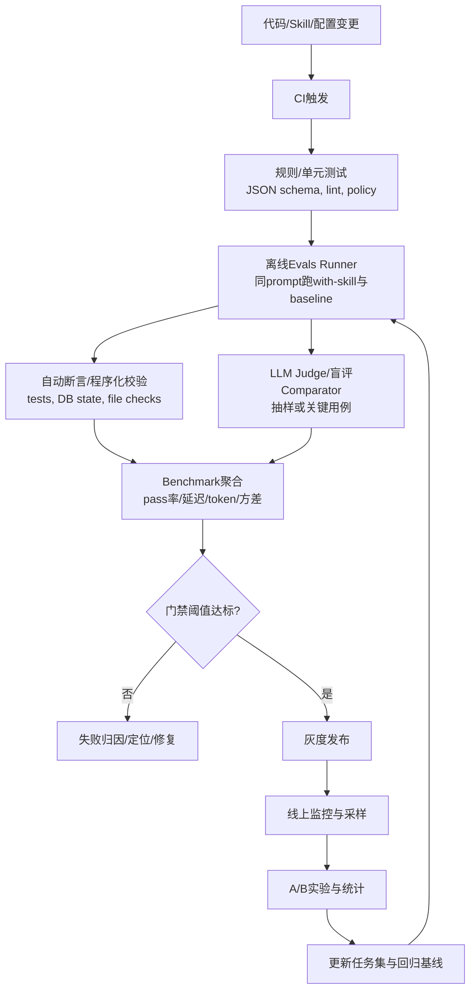

# 企业级 Agent Eval 体系深度研究报告：聚焦 Code Agent 与 Skills 构建中的评测闭环

## 执行摘要

本报告旨在帮助你在“通用企业级业务 agent（含代码执行能力）”这一默认假设下，设计并实现一套可持续迭代、可量化、可自动化、可集成到 CI/CD 的 agent 评测体系，并特别对新增 skill 的评测给出可复用模板与示例实现思路。该假设与 entity["company","Anthropic","ai company"] 的 Agent Skills/Skill-Creator 设计目标高度一致：把“流程知识/组织知识/工具使用方式”封装成可组合的 Skills，并通过 evals/benchmark/对比来验证其可靠性与回归风险。citeturn1view1turn29view3turn30view0

关键结论是：**企业级 agent eval 不能只做“答得像不像”，必须把评价对象拆成可验证的产物与可观测的行为**（最终状态、文件产物、工具调用轨迹、策略遵循、成本与延迟），并对非确定性（同一任务多次运行波动）与评审偏差（LLM-as-a-judge 的位置/冗长/自我偏好等偏差）建立控制机制。与其追求单一“总分”，更可落地的做法是建立“分层门禁”：规则/单元测试做硬门槛，环境状态或程序化断言做主干指标，LLM judge 与人工抽检做补充，线上 A/B 与实验统计用于最终商业决策。citeturn14search8turn28view0turn19search0turn19search1turn24view0turn20search8

针对你特别提出的“参考 Anthropic 最新 Skill-Creator 更新”这一重点，2026-03-03 官方更新将 Skill-Creator 从“辅助写 skill”升级为“带测试与基准的闭环工具”，新增能力包括：编写 eval、运行 benchmark、并行多 agent 执行避免上下文污染、A/B 盲评 comparator、以及用于提升触发准确率的 description 优化与方差分析。citeturn29view3turn30view0turn26view2turn3view1turn28view0

## 研究范围与假设

**默认业务假设（需在你的业务场景落地时进一步定制）**：本报告以“通用企业级业务 agent（含代码执行能力）”为目标系统：agent 能读写文件、执行脚本或调用工具/API，可能通过 Skills 承载流程知识，并在多轮对话中完成任务。该假设与 Agent Skills 的“文件夹/文件/脚本/资源”架构、在沙箱容器中运行、以及通过 description 触发加载的机制一致。citeturn1view1turn21view1turn26view0

**需要你后续补充定制的关键维度**（否则评测指标会失真）：  
业务目标（效率/合规/转化等）、风险边界（能否联网、能否写生产系统）、语言与技术栈（Python/Java/SQL/前端等）、任务时间跨度（短任务还是长链路）、产物形态（文本/代码/表格/PPT/多模态）、以及“正确性”的定义（以数据库最终状态为准、以测试通过为准、还是以人类偏好为准）。citeturn18search0turn1view1turn12search2turn25view1

## Anthropic Skill-Creator 与 Skills 评测闭环要点

### Skills 机制与“触发评测”的必要性

Agent Skills 的核心是**渐进式加载（progressive disclosure）**：启动时只预加载每个 skill 的元数据（name+description），当模型判断相关时才读入 SKILL.md 正文，必要时再读入引用文件或执行脚本；这使得“description 是否触发得恰当”成为一个必须被评测的工程问题，而非纯提示词技巧。citeturn1view1turn26view0turn21view2turn28view1

Skill-Creator 的官方 SKILL.md 进一步强调了“触发测试”应采用**接近真实用户、包含细节且足够复杂的 query**；过于简单的一步请求即使匹配 description 也可能不触发，因为模型认为可用“基础工具”直接完成。citeturn28view1turn26view4

### 2026-03-03 Skill-Creator 更新与“更新日志式”要点归纳

官方博客明确指出：Skill-Creator 新增用于“验证可用、捕捉回归、提升 description”的评测能力，覆盖 Claude.ai 与 Cowork，并可作为 Claude Code 插件或从官方仓库使用。citeturn29view0turn9view0turn30view0

更新要点可按“评测闭环”拆成五类（这相当于一份可执行的更新日志摘要）：

1) **Evals：把 skill 测试变成“类似软件测试”的工件**。定义测试 prompts（以及必要文件），描述“好结果长什么样”，并据此验证 skill 是否稳定工作。citeturn29view2turn26view1turn26view2  
2) **Benchmark：基于 evals 做标准化评估**，跟踪 pass rate、耗时、token 使用，可用于模型升级前后或 skill 改动前后的对比与回归检测。citeturn29view3turn3view1turn26view2  
3) **并行多 agent 执行与“上下文不交叉污染”**：Skill-Creator 用独立 agent 并行跑 eval，每次运行拥有干净上下文与独立 token/时间指标，减少串行运行导致的“上下文渗漏”。citeturn29view3turn26view2  
4) **Comparator：A/B 盲评**（两版本 skill 或 skill vs 无 skill），用于判断改动是否真的更好。citeturn29view3turn26view3turn3view3  
5) **Description 优化与方差分析**：官方仓库版本给出了可自动化的触发优化 loop：构造 should-trigger/should-not-trigger 的 eval set，在 60/40 train/test 切分下评估 description，并对每个 query 运行 3 次估计可靠触发率，最后以 test 集得分选择 best_description 以降低过拟合。citeturn28view0turn28view1turn3view1turn30view0

一个值得注意的“文档差异/演进信号”是：2026 年初官方《Complete Guide》仍提示当时 skill-creator **不执行自动化测试套件或产出量化结果**，而 2026-03-03 更新与插件页面则明确包含 Eval/Benchmark 与方差分析脚本。这意味着你在建立企业内部评测体系时，必须把“评测能力”当作可演进模块来维护，并为工具升级做回归验证。citeturn22view4turn29view3turn30view0

### Skill-Creator 对“新增 skill 评测”的官方流程骨架

官方 SKILL.md 给出了一个完整、可工程化复用的新增/迭代 skill 评测骨架，核心思想是：**同一 eval prompt 同时运行“带 skill”与“baseline”**，并把产物、时间、tokens、断言结果聚合成 benchmark，再进入人工 review 与下一轮迭代。citeturn26view1turn26view2turn3view1

其中“baseline”的官方定义对新增 skill 与改进 skill 有所不同：新增 skill 时 baseline 是“无 skill”；改进已有 skill 时 baseline 可指向旧版本快照（通过复制快照目录实现）。citeturn26view1turn26view2

## 近三年学术与行业趋势：自动化评测、基准、指标与特殊考量

### 评测对象从“输出”扩展到“交互+轨迹+最终状态”

近三年 agent 评测研究的共同趋势是：**agent 的“成功”常常不是一句话，而是环境中的状态变化或可验证产物**。例如：

- WebArena 提供可自托管、可复现的真实 web 环境，让语言指令落到具体网页操作，按任务完成率评估。citeturn10search3turn10search14  
- τ-bench 强调真实业务域中的“用户—agent—工具”多轮互动，并以对话结束后的数据库状态与目标状态比对作为高保真评价，同时提出 pass^k 衡量多次运行的一致性/可靠性。citeturn12search2turn11search16  
- SWE-bench 把代码 agent 的成功定义为：根据 GitHub issue 与代码库生成补丁，并用真实测试验证；其设计强调“可验证性”与“贴近真实开发流程”。citeturn10search5turn25view1turn31view4  
- BFCL 把 tool/function calling 变成可规模化评测对象，覆盖串行/并行调用、多语言，并采用可扩展的结构化评测方法来判断函数调用是否正确。citeturn25view2turn11search1

这些工作共同说明：企业级 agent eval 若只做“文本评分”，会系统性低估或误判 agent 的真实能力与风险；更可持续的做法是把“最终状态/产物/轨迹”作为主要真值来源。citeturn18search0turn12search2turn31view4turn25view2

### LLM-as-a-judge 的兴起与可预期的偏差治理

行业与学术大量采用 LLM-as-a-judge 来扩展开放式任务评测规模。MT-Bench 与 Chatbot Arena 系列工作系统化讨论了 LLM judge 的位置偏差、冗长偏差、自我偏好等问题，并给出缓解方向；Chatbot Arena 也用统计方法与大规模人类偏好投票建立可信排名。citeturn19search0turn19search2turn19search13turn19search15

针对“冗长偏差”，Length-Controlled AlpacaEval 提出通过长度控制/去偏方法提升与人类偏好一致性，提示企业内部使用 LLM judge 时需要显式控制混杂因素（例如回答长度、格式复杂度）。citeturn19search1turn19search5

更近的综述与实证工作进一步指出：judge 的可靠性本身需要被评测，尤其在多语言场景中可能出现不一致。citeturn19search6turn19search3turn19search10

在 agent 场景中，AGENTREWARDBENCH 的结论尤其关键：**环境自带的规则评测（rule-based）与专家对“成功”的定义可能不一致**，rule-based 可能低估 agent 能力或忽略副作用；同时 LLM judge 也存在弱点，需要基准化测试其一致性。citeturn24view0turn25view0

### 安全与对抗：从“提示注入”到“工具真实执行”的评测

企业级 agent 的风险集中在“能行动、能调用工具、能接触数据”。安全研究指出 LLM 集成应用会模糊“数据 vs 指令”的边界，间接提示注入（Indirect Prompt Injection）可通过被检索的数据远程操控系统行为，造成数据泄露、工具滥用等。citeturn16search0turn16search4

行业侧，entity["organization","OWASP","security foundation"] Top 10 for LLM Applications 将 Prompt Injection、Insecure Output Handling 等系统化为常见风险类别，为评测用例设计提供结构化清单。citeturn16search1turn16search9

更贴近 agent 的学术基准包括：  
ToolEmu 通过“LLM 模拟工具执行”与评估来做风险分析；AgentHarm 评测 agent 在恶意多步任务下的有害性；RAS-Eval 则强调覆盖真实工具执行，并把攻击任务映射到 CWE 类别，提供任务完成率与攻击成功率等指标。citeturn11search2turn12search3turn17view1turn16search1

与 Skills 强相关的是：官方 Help Center 明确把 prompt injection 与数据外泄列为 Skills 的主要风险，并强调只从可信来源安装 skill、审计其依赖与资源文件。citeturn21view1turn16search1

## 面向 Code Agent 的评测维度：指标、方法与推荐实践

本节给出一套“可落地、可量化”的 code agent 评测维度框架，并对每个维度给出**建议指标 + 可自动化测量方式 + 常见陷阱**。设计原则是：优先采用可复现、可验证的度量（tests、最终状态、结构化断言），把主观偏好评估留给盲评/抽样人工。citeturn18search0turn29view2turn25view1turn12search2

### 功能正确性与端到端可验证性

**核心指标**：task success rate（任务通过率）、unit/integration tests 通过率、回归率（Regression）、无效修复率（No-Op）。citeturn25view1turn31view3turn27view2turn12search2

**推荐方法**：  
- 对“修 bug/加 feature”类任务，优先采用 SWE-bench 风格：给定 repo 与 issue，生成 patch，用真实测试评估；并明确区分“修复目标行为”和“保持既有行为”，通过 F2P/P2P 测试结果拆解失败模式（Resolved / Regression / No-Op 等）。citeturn25view1turn31view2turn31view4turn27view2  
- 对企业内部代码库，建议引入“隐藏测试/私有评测集”机制来降低过拟合和污染风险（SWE-bench Pro 将数据分为 public/private 并保留私有评测集以维护评测完整性，是可借鉴的工程策略）。citeturn27view0turn18search0

**常见陷阱**：只用可见测试会导致 agent “学会过拟合”；只看“测试通过”会忽略副作用（例如性能退化、隐私泄露、破坏边界条件），因此需要把安全/性能门禁并列纳入。citeturn27view0turn16search1turn29view3turn31view2

### 鲁棒性、可靠性与非确定性治理

**核心指标**：pass@k / pass^k（多次采样或多次运行的成功率）、方差/标准差、flakiness（同一用例多次运行结果不稳定）。citeturn12search2turn13search3turn3view1turn30view0

**推荐方法**：  
- 对随机性强的 agent loop，采用 τ-bench 的 pass^k 思路：同一任务重复运行 k 次，衡量一致成功概率，避免“单次成功”掩盖系统不稳定。citeturn12search2  
- 对 Skills 触发与评测，借鉴 Skill-Creator 的做法：每条 query 运行多次以估计可靠触发率；聚合 benchmark 时输出 mean±stddev，并在分析环节标记“高方差”用例为潜在 flaky。citeturn28view0turn3view1turn3view2turn30view0  
- 对长链路代码任务，优先做“阶段性断言”（编译通过、关键测试集通过、性能不退化、权限不越界），并将失败定位到具体阶段。相关研究表明长链路 CLI/工程任务仍远未解决，失败往往集中在早期步骤，因此“分阶段测量”比只看最终成败更能指导工程改进。citeturn13search4turn18search0

### 安全、权限与合规

**核心指标**：危险动作触发率（例如越权调用、访问不该访问的文件/系统）、prompt injection 成功率、数据外泄指示、攻击任务成功率（ASR）、安全拒绝一致性。citeturn16search1turn17view1turn12search3turn21view1

**推荐方法**：  
- 用 OWASP Top 10 for LLM Apps 的条目做“风险覆盖矩阵”，把每类风险映射到至少一组红队用例与一个可自动检测的信号（日志、策略判定、静态扫描）。citeturn16search1turn16search9  
- 在 tool/agent 环境层引入对抗评测基准的结构化指标：ToolEmu（风险识别与工具模拟）、AgentHarm（恶意多步任务有害性）、RAS-Eval（真实工具执行+攻击覆盖+失败模式分类）。citeturn11search2turn12search3turn17view1  
- 对 Skills：官方明确提示最主要风险是 prompt injection 与 data exfiltration，并强调部署前审计 skill 内容与依赖；因此企业内部应把“技能包审计（dependencies、脚本、资源）”作为评测门禁的一部分，而非上线后再补。citeturn21view1turn16search0turn16search1

### 可解释性、可审计性与可定位性

**核心指标**：可追溯的决策与行动日志覆盖率（tool call、文件写入、外部请求）、失败归因质量（是否能定位到某类用例/某类工具/某类规则）、以及人类 review 的效率（单位时间可评审用例数）。citeturn18search0turn30view0turn14search16turn15search0

**推荐方法**：  
- 采用“评测=测试 + 可观测性”的组合：LangSmith、Langfuse、Phoenix、TruLens 等都把 tracing + eval 作为一体化能力，用于把一次 agent run 拆解为可诊断的步骤并附加评分。citeturn14search4turn15search0turn15search1turn15search2  
- 对 Skills：Skill-Creator 的 viewer/benchmark 设计强调同时展示定性输出与定量 benchmark，并在 analyzer 阶段寻找“聚合指标看不到的模式”。这类“定量+样例”联动是企业评测中提升定位效率的关键。citeturn3view1turn4search9turn26view2

### 性能与成本

**核心指标**：端到端延迟、tokens/调用次数、工具耗时、单位任务成本（可折算为金钱）、以及在不同版本/模型更新后的回归趋势。citeturn29view3turn26view2turn3view1turn15search8

**推荐方法**：  
- Skill-Creator 官方 benchmark 明确把 pass rate、elapsed time、token usage 作为标准化指标，并要求在每次 run 完成时抓取 token 与 duration（否则无法复现成本）。citeturn29view3turn26view2  
- 在 CI 中运行 eval 时，需要缓存与分层执行，以控制 LLM API 成本；LangSmith 的文档把“unit test 可用于 CI、并建议在 CI 中配置缓存降低 API 调用成本”作为实践要点。citeturn14search8turn14search0

## 可操作落地路线：从离线评测到 CI/CD 与线上 A/B

### 实施步骤、优先级与时间估计

下表给出一个“从 0 到 1”落地评测体系的建议节奏（时间为经验估计，需按你的团队规模/系统复杂度调整）。该路线强调先建立**最小可用评测闭环（MVE：Minimum Viable Evaluation）**，再逐步扩展覆盖面与自动化程度。citeturn18search0turn29view3turn26view2

| 阶段（优先级） | 目标 | 关键产出物 | 预计周期 |
|---|---|---|---|
| P0 | 建立“代表性任务集 + 结果可验证” | 20–50 条业务代表任务；每条任务的判定准则（最终状态/文件/断言）与输入样本；最小 runner（可复现运行） | 1–2 周 |
| P0 | 为新增 skill 建立评测模板（对齐 Skill-Creator） | evals.json / eval_metadata.json / grading.json / timing.json / benchmark.json 的内部规范；baseline 定义；失败分类标签 | 1–2 周 |
| P1 | 引入多次运行与方差度量 | pass^k 或多次重复运行机制；mean±stddev 报表；flaky 用例清单 | 1–2 周 |
| P1 | 安全评测门禁 | OWASP 风险覆盖矩阵；prompt injection/数据外泄/越权动作用例；静态扫描与运行时告警规则 | 2–4 周 |
| P2 | CI/CD 集成与阈值门禁 | PR 触发 eval；对比基线版本；自动评论/报告；主分支门禁阈值 | 2–3 周 |
| P2 | 线上小流量 A/B 与统计分析 | 线上指标体系（OEC）；实验分桶；显著性与功效分析；回滚策略 | 3–6 周 |
| P3 | 长期演进（模型升级/技能扩展） | 回归趋势看板；私有评测集；自动采样真实日志生成新用例 | 持续 |

统计与实验设计方面，若你的 agent 面向真实用户，最终决策应落到在线对照实验（A/B test）或等价的严谨实验框架；“信得过的在线实验”强调避免偷看（peeking）、功效不足、以及多重比较等问题。citeturn20search8turn20search1turn19search2

### CI/CD 评测流水线示意（推荐）

下面的流程图把“离线 eval + CI 门禁 + 线上实验”串成闭环，并将 Skills 的 trigger 测试与输出质量测试作为并列环节（因为“输出好”必须以“触发对”作为前提）。citeturn29view3turn28view1turn14search1turn14search0turn20search8



工具层面，可直接复用行业已有“在 PR 上自动运行 eval 并展示前后对比”的实践：例如 promptfoo 提供 GitHub Action 在 PR 上自动跑 eval 并给出对比视图；LangSmith 文档提供将 evaluation 纳入 CI/CD pipeline 的示例。citeturn14search1turn14search5turn14search0turn14search9

### 新增 Skill 的评测模板与示例代码

以下模板对齐 Skill-Creator 官方结构：用 `evals/evals.json` 存测试集，用 `eval_metadata.json` 承载断言，并在每次运行结束后写入 timing、grading，最终聚合成 benchmark。citeturn26view1turn26view2turn3view1turn30view0

#### 目录结构模板（建议）

```text
my-skill/
  SKILL.md
  scripts/...
  references/...

my-skill-workspace/
  iteration-1/
    eval-0-generate-report/
      with_skill/
        outputs/
        timing.json
        grading.json
      baseline/
        outputs/
        timing.json
        grading.json
      eval_metadata.json
    eval-1-edge-case-bad-input/
      ...
    benchmark.json
    benchmark.md
```

要点：  
- 每个 eval 同时跑 with_skill 与 baseline（新增 skill 时 baseline=without_skill；改进 skill 时 baseline=old_skill 快照）。citeturn26view1turn26view2  
- timing 数据需要在 run 完成通知出现时立即落盘（否则可能丢失），并用于 benchmark 的时间/token 统计。citeturn26view2turn3view1  
- benchmark 聚合建议输出 mean±stddev 与 delta，并做一次 analyst pass 找出高方差/不区分用例/成本权衡。citeturn3view1turn3view2turn4search9

#### evals.json 示例（可作为“你的企业内部规范”起点）

```json
{
  "skill_name": "my-skill",
  "evals": [
    {
      "id": 0,
      "prompt": "请读取data/sales.csv，按区域汇总收入并输出output/summary.csv，同时给出三条业务洞察。",
      "expected_output": "生成summary.csv且汇总正确；洞察与数据一致",
      "files": ["data/sales.csv"]
    },
    {
      "id": 1,
      "prompt": "同样的任务，但sales.csv缺少'amount'列；请给出可执行的错误处理建议，不要生成错误文件。",
      "expected_output": "明确指出缺失字段；不生成summary.csv或生成但包含可识别的错误标记",
      "files": ["data/sales_missing_amount.csv"]
    }
  ]
}
```

该 schema 与官方示例一致（先写 prompt，再逐步补 assertions）。citeturn26view1turn26view2

#### eval_metadata.json 与 grading.json 示例（断言可程序化 + 可读）

```json
{
  "eval_id": 0,
  "eval_name": "generate-report",
  "prompt": "（同上）",
  "assertions": [
    {
      "id": "csv_exists",
      "type": "programmatic",
      "description": "output/summary.csv 存在且可解析"
    },
    {
      "id": "aggregation_correct",
      "type": "programmatic",
      "description": "区域汇总数值与基准实现一致（容差1e-6）"
    },
    {
      "id": "insights_grounded",
      "type": "llm_judge",
      "description": "洞察与summary.csv一致，不杜撰"
    }
  ]
}
```

```json
{
  "expectations": [
    {"text": "csv_exists", "passed": true, "evidence": "parsed rows=12"},
    {"text": "aggregation_correct", "passed": true, "evidence": "max_abs_err=0.0"},
    {"text": "insights_grounded", "passed": false, "evidence": "insight #2 mentions APAC growth but APAC revenue declined"}
  ]
}
```

字段命名建议兼容 Skill-Creator viewer 的要求（`text/passed/evidence`），便于你直接复用其聚合与展示思路。citeturn26view2turn3view1

#### 最小可用 Python Runner 伪代码（需按你的框架/模型接口改造）

```python
from __future__ import annotations
import json
import time
from dataclasses import dataclass
from pathlib import Path
from typing import Any, Dict, List, Tuple

@dataclass
class RunResult:
    outputs_dir: Path
    total_tokens: int
    duration_ms: int
    metadata: Dict[str, Any]

def call_agent(prompt: str, files: List[Path], with_skill: bool) -> RunResult:
    """
    你的实现：调用 agent（带/不带 skill），让其在沙箱里生成 outputs。
    需要确保每次运行上下文隔离，避免跨用例污染（可通过新容器/新会话实现）。
    """
    start = time.time()
    # TODO: run agent, collect outputs, tokens
    outputs_dir = Path("...")  # where your agent wrote artifacts
    total_tokens = 0
    duration_ms = int((time.time() - start) * 1000)
    return RunResult(outputs_dir=outputs_dir, total_tokens=total_tokens, duration_ms=duration_ms, metadata={})

def assert_csv_exists(outputs_dir: Path, rel: str) -> Tuple[bool, str]:
    p = outputs_dir / rel
    if not p.exists():
        return False, f"missing: {rel}"
    try:
        _ = p.read_text(encoding="utf-8")
        return True, f"exists: {rel}"
    except Exception as e:
        return False, f"unreadable: {e}"

def run_eval_case(case: Dict[str, Any], workspace_eval_dir: Path) -> None:
    prompt = case["prompt"]
    files = [Path(x) for x in case.get("files", [])]

    # with_skill
    r1 = call_agent(prompt, files, with_skill=True)
    (workspace_eval_dir / "with_skill" / "timing.json").write_text(
        json.dumps({"total_tokens": r1.total_tokens, "duration_ms": r1.duration_ms}, ensure_ascii=False, indent=2),
        encoding="utf-8",
    )

    # baseline
    r0 = call_agent(prompt, files, with_skill=False)
    (workspace_eval_dir / "baseline" / "timing.json").write_text(
        json.dumps({"total_tokens": r0.total_tokens, "duration_ms": r0.duration_ms}, ensure_ascii=False, indent=2),
        encoding="utf-8",
    )

    # programmatic assertions example
    passed, evidence = assert_csv_exists(r1.outputs_dir, "output/summary.csv")
    grading = {"expectations": [{"text": "csv_exists", "passed": passed, "evidence": evidence}]}
    (workspace_eval_dir / "with_skill" / "grading.json").write_text(
        json.dumps(grading, ensure_ascii=False, indent=2), encoding="utf-8"
    )

def main() -> None:
    evals = json.loads(Path("evals/evals.json").read_text(encoding="utf-8"))
    ws = Path("my-skill-workspace/iteration-1")
    ws.mkdir(parents=True, exist_ok=True)
    for case in evals["evals"]:
        d = ws / f"eval-{case['id']}"
        d.mkdir(parents=True, exist_ok=True)
        run_eval_case(case, d)

if __name__ == "__main__":
    main()
```

实现时需要特别关注三点：  
(1) 上下文隔离（避免跨用例污染）——官方更新把并行独立 agent 与 clean context 作为关键能力；citeturn29view3turn26view2  
(2) baseline 的一致定义与版本快照（支持真实 A/B 对比与回归检测）；citeturn26view1turn26view2turn26view3  
(3) 断言优先程序化、主观项再交给盲评/抽检——这也是 Skill-Creator 建议“主观技能更多做定性评审”的原因。citeturn26view2turn26view3turn19search0

## 工具、指标、数据集与评测类型对比表

### 工具与开源库对比（偏工程落地）

| 工具/项目 | 覆盖对象 | 强项 | 与 CI/CD 集成 | 备注 |
|---|---|---|---|---|
| Skill-Creator（官方 Skills 插件/仓库） | Skills 开发与评测 | Create/Eval/Improve/Benchmark 四模式；多 agent 并行；盲评 comparator；方差分析与聚合脚本 | 可将 evals/benchmark 结果“本地保存、接 dashboard、接 CI” | 官方说明可用于验证、回归与触发优化。citeturn30view0turn29view3turn26view2turn3view1 |
| Claude Console Evaluation Tool | Prompt/模板评测 | UI 化 test case 生成、side-by-side 对比、质量打分与版本化 | 更偏人工/半自动流程 | 适合快速建立初始测试集，再迁移到自动 runner。citeturn9view3 |
| LangSmith（entity["company","LangChain","llm tools company"]） | LLM/agent 应用评测与可观测 | evaluation types、tracing、CI/CD pipeline 示例 | 官方提供 CI/CD + evaluation 示例文档 | 适合将 eval 与观测、部署联动。citeturn14search0turn14search4turn14search8turn14search16 |
| promptfoo | Prompt/agent/RAG eval + 安全扫描 | GitHub Action 在 PR 上自动跑 eval、展示前后对比；CI/CD 集成与安全扫描 | GitHub Action / 多种 CI 支持 | 可做“门禁+红队扫描”。citeturn14search1turn14search5turn14search9turn14search13turn14search17 |
| OpenAI Evals（entity["company","OpenAI","ai company"]） | LLM/系统评测框架 | 可自定义 eval registry | 可脚本化接入 CI | 更偏框架与注册表思路，需自行搭配观测。citeturn14search2turn14search6 |
| lm-evaluation-harness（entity["organization","EleutherAI","open research org"]） | 语言模型基准评测 | 大量标准任务与统一 harness | 可脚本化 | 偏“模型能力”，对 agent/工具轨迹需额外开发。citeturn14search3 |
| Langfuse | tracing + eval | 自托管、指标与成本追踪、LLM judge 支持 | 可通过 API/SDK 接 CI | 适合企业内私有化可观测。citeturn15search0turn15search8 |
| Phoenix（Arize） | 实验/评测/观测 | eval quickstart、tracing | 脚本化 | 常用于 RAG/生成评估，也可扩展 agent。citeturn15search1turn15search9 |
| TruLens | agent/RAG eval + tracing | 对 agent 执行流做组件级评估 | 脚本化 | 适合“从 vibes 到 metrics”的落地。citeturn15search2turn15search6 |
| Ragas | RAG 评估 | 低标注依赖的 RAG 指标与测试集生成 | 脚本化 | 若你的 agent 强依赖检索，可作为 RAG 子评测层。citeturn15search3turn15search23 |

### 基准数据集对比（偏能力评测与回归参考）

| 基准/数据集 | 领域 | 评价信号 | 你可借鉴的点 |
|---|---|---|---|
| SWE-bench / Verified / Pro（家族） | 软件工程 code agent | 生成 patch + 真实测试验证；Verified 人工过滤提升可解性；Pro 引入 public/private 维护评测完整性 | 用“可验证测试+私有集”控制过拟合；用失败类型拆分定位。citeturn10search5turn27view1turn27view0turn27view2turn31view2 |
| SWE-agent | 软件工程 agent 系统 | 强调 agent-computer interface 设计影响表现；报告 pass@1 等指标 | 评测不只测模型，也要测 scaffold/接口设计。citeturn13search3 |
| AgentBench | 通用 LLM-as-Agent | 多环境、多维度评测包 | 适合作为企业内部“能力面板”的参考结构。citeturn10search2turn10search9 |
| WebArena | Web agent | 自托管 web 环境 + 任务完成率 | 可复现环境对 agent 评测至关重要。citeturn10search3turn10search14 |
| VisualWebArena | 多模态 web agent | 图文输入 + web 操作任务 | 若你的业务涉及截图/GUI，多模态评测应覆盖。citeturn11search3turn11search11 |
| τ-bench | 工具/业务域对话 agent | 以最终 DB 状态对比目标；pass^k 度量一致性 | 强烈建议借鉴“最终状态=真值”的评测方式。citeturn12search2 |
| BFCL | tool/function calling | 结构化判定函数调用正确性，覆盖多语言与并行调用 | 把 tool 调用当作可单测对象，与端到端任务并行评测。citeturn25view2turn11search1 |
| ToolBench / MetaTool / ToolLLM | tool 使用与选择 | API/tool 任务与自动评估器 | 适合做“tool 选择/调用”子能力评测。citeturn12search12turn12search1turn12search0 |
| ToolEmu / AgentHarm / RAS-Eval | agent 安全 | 工具模拟/恶意任务/真实工具执行与攻击覆盖 | 将安全评测前置为上线门禁，而非事后补救。citeturn11search2turn12search3turn17view1 |
| AGENTREWARDBENCH | web agent 轨迹评测 | 专家标注轨迹成功/副作用/循环；对比 LLM judge 与 rule-based | 警惕“规则评测≠专家成功定义”，需要校准评测器。citeturn24view0turn25view0 |

## 优先阅读的官方与原始来源清单与下一步行动

### 优先阅读清单（官方/原始来源优先）

1. entity["company","Anthropic","ai company"] 官方：Skill-Creator 更新公告（2026-03-03）——解释 eval/benchmark/多 agent/触发优化。citeturn29view3turn29view0  
2. Skill-Creator 插件页（四模式、四子 agent、方差分析脚本）——把能力边界讲得最工程化。citeturn30view0  
3. Skill-Creator 官方仓库 SKILL.md（评测工件结构、baseline 定义、timing/grading/benchmark 约定、触发优化 loop）。citeturn26view1turn26view2turn28view0turn3view1  
4. Agent Skills 官方文档（Skills 架构、渐进式加载、API/Claude Code/SDK 支持方式）。citeturn1view1  
5. Claude Help Center：Skills 使用与安全提示（prompt injection、数据外泄、审计建议）。citeturn21view1  
6. SWE-bench（ICLR 2024）与 SWE-bench Verified 官方说明/博客（可验证的代码 agent 评测范式与“评测本身也需校准”的观点）。citeturn25view1turn27view2turn27view1  
7. τ-bench（pass^k、一致性与最终状态评测）与 BFCL（结构化 tool calling 评测）。citeturn12search2turn25view2  
8. LLM-as-a-judge：MT-Bench/Chatbot Arena 与 Length-Controlled AlpacaEval（judge 偏差与去偏）。citeturn19search0turn19search2turn19search1  
9. 安全评测：Indirect Prompt Injection、OWASP Top 10 for LLM Apps、AgentHarm、RAS-Eval。citeturn16search0turn16search1turn12search3turn17view1  
10. 工程落地工具：LangSmith CI/CD eval 示例、promptfoo GitHub Action。citeturn14search0turn14search1turn14search5  

### 建议的下一步行动清单（按“最短路径落地”排序）

- 建立一份“业务代表任务集”v0（20–50 条），每条任务明确：输入、期望产物/最终状态、失败分类与风险等级，并将其版本化（例如放在仓库 `evals/`）。citeturn18search0turn23view2turn26view1  
- 先实现 **P0 评测门禁**：可程序化判定的断言（文件存在、JSON 可解析、测试通过、DB 状态一致），把主观 judge 限制在少量关键用例抽检。citeturn26view2turn12search2turn19search0  
- 复刻 Skill-Creator 的“with_skill vs baseline”对照框架：新增 skill 的 baseline=无 skill；改进 skill 的 baseline=旧版本快照，并输出 benchmark（pass/latency/token/方差）。citeturn26view1turn26view2turn3view1turn29view3  
- 加入非确定性治理：对关键用例执行多次运行，计算 pass^k 或方差，并把高方差用例标记为 flaky（单独治理或隔离出 CI 门禁）。citeturn12search2turn3view2turn30view0  
- 建立“触发准确率评测”并做 description 优化：按官方建议构造 near-miss 的 should-not-trigger，用 train/test 分割与多次运行避免过拟合与偶然性。citeturn28view0turn28view1turn21view2  
- 接入 CI：PR 上自动跑小规模 smoke eval（例如 10 条）并展示对比；主分支/夜间任务跑全量 eval；参考 promptfoo action 或 LangSmith 的 CI/CD 示例。citeturn14search1turn14search0turn14search8  
- 建立安全评测清单：以 OWASP Top 10 为覆盖框架，把 prompt injection/不安全输出处理/越权访问/数据外泄转换为可执行的红队用例，并引入 ToolEmu/AgentHarm/RAS-Eval 类指标体系作为参考。citeturn16search1turn11search2turn12search3turn17view1  
- 当离线 eval 达到稳定后，再引入线上 A/B：定义 OEC（整体评估准则）与护栏指标，做灰度与显著性分析，并遵循可信在线实验的原则（避免偷看、多重比较与功效不足）。citeturn20search8turn20search1turn19search2