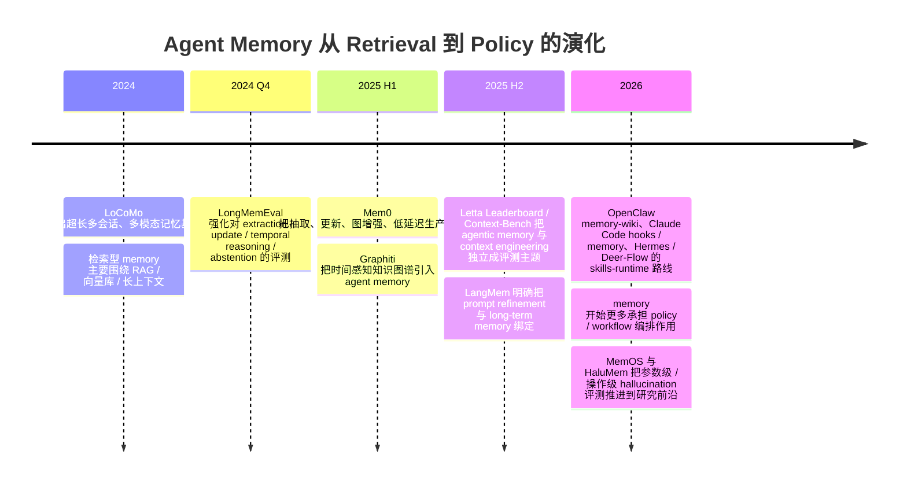

# Agent Memory 设计理念分析报告

## Executive summary

从 2024 到 2026 年的公开实现看，所谓 agent memory 其实已经明显分成三类：**A 型检索型 memory**，本质上是“写进去、召回出来”；**B 型程序性 memory**，本质上是“过去经验改变之后的工具使用、策略选择与提示结构”；**C 型参数化 memory**，本质上是“把经验沉淀为参数级或激活级的长期能力”。当前大多数开源项目，仍然处在 A 型或 A→B 过渡阶段。真正把“过去经验塑造未来行为”作为一等公民来设计的，主要是 entity["company","Letta","stateful agents startup"] 的 memory blocks / MemFS、entity["company","LangChain","llm tooling company"] 的 LangMem、OpenClaw 的 memory-wiki / plugin-memory 体系，以及论文与工程愿景都更“激进”的 MemOS。citeturn8search2turn39search0turn39search2turn41view3turn14view0turn41view0turn9search7

如果把“memory”狭义理解为持久化 RAG，那么 Mem0、Graphiti、Redis Agent Memory Server、claude-mem、OpenClaw 基础 memory，以及很多社区 memory 模块，确实都还是**围绕写入、压缩、索引、检索、注入上下文**在展开；它们提高的是 recall、时序检索、可扩展性、可审计性与 token 效率，而不是直接改写 agent 默认 policy。换句话说，它们多数是“经验可被取回”，而不是“经验已经内化成新的默认做事方式”。citeturn22search1turn15search0turn16search2turn21view0turn13search1turn10search2

真正值得你重点关注的趋势，是**从 retrieval memory 走向 policy memory**。这条路有三种代表实现：一是 Letta 这类把 memory 放进上下文主干、让 agent 自己维护 block 的体系；二是 LangMem 这类把 memory 与 prompt refinement、background consolidation 绑定的体系；三是 OpenClaw / Claude Code / Hermes 一类，把 memory 与 hooks、skills、plugins、workspace files 绑定，使“记住什么”直接影响“默认怎么做”。其中最系统地提出 A/B/C 一体化路线的，是 MemOS：它在论文层面明确提出统一 plaintext、activation-based 与 parameter-level memory，而在仓库层面又把 skill memory、tool traces、knowledge cubes、feedback correction 放进同一套 Memory OS 叙事里。citeturn39search5turn41view3turn40search0turn40search1turn41view0turn9search7

如果你的目标是自己构建业务 agent，我的结论很直接：**不要直接问“选哪一个 memory 框架”，而要先问“你的业务需要 A、B 还是 C 型 memory”**。客服、销售、知识助理，优先 A；代码 agent、研究 agent、长期工作流 agent，至少要 A→B；如果你追求真正的技能沉淀与跨任务迁移，再考虑 C。评测上也必须同步升级：A 型测 recall 与 answer quality；B 型测 policy shift、tool choice、cross-session consistency；C 型再加 retention、rollback、catastrophic forgetting 与 hallucination-at-operation-stage。LongMemEval、LoCoMo、HaluMem 与 Letta Evals 正好对应了这条升级路径。citeturn42search0turn42search6turn42search2turn42search1turn39search1turn39search8

本报告优先使用官方 README、官方文档、源码仓库、官方 release / repo 页面，以及 2024–2026 的 benchmark / arXiv 材料。对 Hermes Agent、Deer-Flow 这类**明确提到 memory 但未公开独立 memory 设计说明**的项目，我额外查看了仓库目录、README 与 release 信息；若仍不足以判断其内核设计，则标注为“未公开实现细节”。citeturn19view3turn35search3turn41view2turn18view8

## 横向对照

说明：下表中的 **“6m commits≈”** 为近似值。若公开页面仅提供 *past year commits*，我按一半粗估近 6 个月值；若公开页面未给出年度 commits，则标注“未直接公开”，并用最近更新、PR / issue 活跃度与 release 节奏辅助判断热度。

A/B/C 含义：**A=检索型 memory**，**B=程序性 / policy memory**，**C=参数化 memory**。

| 项目 | 记忆载体 | 写入策略 | 检索机制 | 自动化层次 | 行为塑形能力 | 可审计性与治理 | 压缩/摘要策略 | 多模态 | 延迟/扩展 | 典型场景 | 源码入口与关键路径 | 社区 / 评测 |
|---|---|---|---|---|---|---|---|---|---|---|---|---|
| Mem0 | 向量库 + metadata；图存储可选 | 自动抽取；支持 update/delete/feedback | semantic + reranker；graph relations 并行返回 | A（向 B 靠近） | 中低；主要通过召回偏好/事实影响回答，不直接改写默认 policy | 中；CRUD 完整，但版本回滚不是一等公民 | salient fact extraction；graph edge consolidation | 支持图像/文档 | 官方研究强调低延迟、低 token；适合服务化扩展 | 个性化助理、客服、企业知识记忆 | `mem0/` → `mem0-ts/` → `evaluation/` → `openmemory/` | 高；53.2k★；6m commits≈297；open issues/PR 82/140；官方 LoCoMo：Mem0 66.9%，Mem0g 68.4%，较 full-context 大幅降延迟与 token。citeturn20view0turn18view0turn22search1turn22search3turn23search0turn22search0turn23search4turn24search0turn31search0 |
| OpenClaw | `MEMORY.md` + 日志 Markdown + 可选 `DREAMS.md`；插件索引；可并联 wiki vault | 显式“remember”；pre-compaction 自动 flush；`memory-lancedb` 支持 auto-recall/capture | hybrid(BM25+vector) + MMR + temporal decay；`wiki_search` / `memory_search` | A→B | 中；记忆文件与编译 digest 会进入上下文，能改变下一轮默认行为 | 高；文件可见、可审查；memory-wiki 有 claims / evidence / contradiction / stale dashboards | daily log、dreaming、compiled digest | 记忆本体偏文本；整体能力依赖插件 | 本地优先，SQLite / QMD / LanceDB，扩展性好 | 本地 coding assistant、长期个人代理、可审计工作流 | 先读 `docs/concepts/memory`、`docs/tools/plugin`、`docs/plugins/memory-wiki`；再在仓内搜索 `memory-core` / `memory-wiki` / `memory-lancedb` | 很高；359k★；6m commits 未直接公开；issues/PR 5k+；未见官方统一 benchmark。citeturn20view1turn10search2turn13search1turn11view0turn14view0turn12view0 |
| claude-mem | SQLite + FTS5 + optional Chroma；hook event DB；viewer UI | 完全自动：hook 捕获 tool traces，stop hook 生成 summary | progressive disclosure：search → timeline → get_observations；FTS5 + hybrid retrieval | A | 低到中；通过上下文注入和 session summary 影响后续工作，但不维护独立 policy 层 | 中；本地 DB 与 viewer 可见，但治理/回滚不如文件化方案直观 | session summaries；index/timeline/details 三层压缩 | 面向代码与工具轨迹；非通用多模态 | 强调 token 效率与本地查询速度 | 代码 agent、工程历史回忆、调试回溯 | `plugin/` → `src/` → `docs/architecture/` → `tests/` → `cursor-hooks/` | 高；58.5k★；6m commits 未直接公开；open issues 140；官方强调 50–75% token 节省、约 10x 搜索效率优势，未见标准 benchmark。citeturn20view2turn19view0turn15search0turn15search1turn15search4 |
| Letta | memory blocks（in-context）+ archival memory + conversation search + filesystem；Letta Code 上有 MemFS | agent 自主维护 block；也可 API / server-side memory tools；MemFS 用 bash / git 修改 | blocks 永远可见；外部 memory 按需搜索；层级式上下文管理 | B（A/B 融合） | 高；block description 直接指导模型如何读写 memory；MemFS 让记忆像代码一样被维护 | 很高；blocks 可读写/只读/共享；MemFS 有 git 版本化与回滚；官方有 Evals | block = executive summary；外部 memory 保存细节 | 文档与文件系统支持强；原生多模态不是记忆主轴 | 以 context-window 管理为核心，适合长时 stateful agent | workspace agent、长期助手、多 agent 协作 | `letta/` → `db/` → `tests/` → `examples/`；文档先读 memory overview / memory blocks / MemFS / evals | 高；22.1k★；6m commits 以 449 PR/年保守估约 200+；past-year issues/PR 129/449；官方主打 Letta Evals、Letta Leaderboard、Context-Bench，而非单一“Letta 分数”。citeturn20view3turn18view2turn8search2turn39search0turn39search2turn39search1turn39search7turn39search11turn43search2turn43search3 |
| LangMem | 任意 store + LangGraph long-term store | hot-path memory tools + background memory manager + prompt refinement | search/manage memory tools；依赖底层 store | A→B | 中高；其差异点不是只存用户事实，而是**优化 agent behavior** 与 prompt | 中；治理更多依赖底层 store；框架本身偏 primitives | 自动 extraction / consolidation / update | 未强调原生多模态 | 能与 LangGraph 原生集成，工程落地轻 | LangGraph agent、可持续 prompt / behavior optimization | `src/langmem/` → `examples/` → `tests/` → `docs/` | 中高；1.4k★；总 commits 113，6m commits 粗估约 50+；past-year issues/PR 54/79；未见独立 benchmark。citeturn19view1turn41view3turn36search3 |
| Graphiti | temporal knowledge graph：episodes / entities / communities；Neo4j / FalkorDB + embeddings + full-text | 自动 ingest episodes，抽取实体/关系/时间 | semantic + BM25 + graph + time + center-node rerank | A（结构化增强） | 中低；世界模型更强，但最终仍以 retrieval 注入为主 | 中高；图本身可查询、可检查、可保留历史关系 | community summaries；time-aware graph compaction | 以文本/结构化数据为主 | 文档强调高并发 ingest；论文给出更低延迟 | enterprise memory、时间推理、跨会话关系追踪 | `graphiti_core/` → `mcp_server/` → `server/` → `examples/` → `tests/` | 高；25k★；6m commits 未直接公开；issues/PR 165+/79+；官方论文：DMR 94.8 vs 93.4，LongMemEval 最高 +18.5% accuracy、约 90% latency reduction。citeturn20view4turn18view3turn16search2turn16search1turn9search3turn9search4turn30search6 |
| MemOS | 统一 plaintext / activation / parameter memory；KB、tool traces、skill memory、memory cubes | 统一 add/retrieve/edit/delete；feedback correction；async MemScheduler；skill evolution | unified memory API；多 cube 组合；图式可编辑 memory | A/B/C | 很高；明确把 skill reuse / evolution 与 parameter-level memory 纳入 memory 范畴 | 中高；仓库强调 inspectable/editable graph，但参数级治理仍偏研究态 | scheduler + task summarization + skill evolution | 强；文本、图像、tool traces、persona | 目标是高并发、毫秒级 memory ops | 追求“Memory OS”的统一底座、长期技能沉淀 | `src/` → `evaluation/` → `examples/` → `apps/` → `docs/` | 中高；8.4k★；6m commits 未直接公开；open issues/PR 85/18；官方有 MemOS 论文与 HaluMem 论文，但仓库未给稳定产品级统一分数。citeturn20view5turn18view5turn9search7turn41view0turn42search1 |
| Hermes Agent | 公开资料显示是“agent + plugins + skills”体系；独立 memory 模块文档稀缺 | 可能经由 skills / routines / plugins 写入状态；细节未公开 | 未见独立 memory 检索机制文档 | B 倾向，但证据不足 | 中；“the agent that grows with you”与 skills/routines 暗示会塑形，但缺可验证 memory 设计文档 | 未公开实现细节 | 未公开实现细节 | 平台能力丰富，但非 memory 专项文档 | 开发活跃，release 频繁 | 长期个人代理、跨平台自动化 | `agent/` → `plugins/` → `skills/` → `optional-skills/` → `hermes_state.py` → release notes | 高；92.5k★；最新 release 自称自 v0.8.0 起 487 commits、269 merged PR、167 resolved issues；但未见公开 memory benchmark。citeturn20view6turn19view3turn35search3 |
| Deer-Flow | README 明示 harness 会编排 sub-agents、memory、sandboxes、skills；独立 memory 设计说明未见 | 未公开；可能内嵌于 backend runtime | 未公开；仓库与 README 未给独立 memory query 层说明 | A/B 模糊 | 中；更像“memory + skills + subagents”的总线，而非单体 memory 引擎 | 未公开实现细节 | 未公开实现细节 | 项目整体支持多形态任务，但 memory 多模态细节未见 | 长时 research / coding harness | 长周期深研、分层子代理编排 | `backend/` → `skills/public/` → `docs/`；memory 相关建议在仓内搜索 `memory` / `state` / `session` | 高；62k★；6m commits 未直接公开；open issues/PR 394+/186+；未见 memory 专项 benchmark。citeturn20view7turn18view8turn41view2turn29view2 |
| OpenClaw 插件生态 | memory slot + bundled memory plugins + community plugins + ClawHub | 通过 plugin / skill / background service / context engine 注入 | 由具体 memory plugin 决定；生态本身是装配层 | B | 高；插件与技能会改变 agent 的工具面与默认流程，属于“外接 procedural memory surface” | 中；有 allow/deny、manifest/schema、plugin inspect，但插件是 in-process trusted code | 依具体插件；如 lossless-claw 做 DAG compaction，memory-wiki 做 belief compile | 依插件 | 最大优势是可扩展，不是统一算法 | 企业内定制、第三方 memory 扩展、知识编译层 | 先读 `docs/tools/plugin`、`docs/plugins/community`、`docs/plugins/memory-wiki`、`docs/concepts/memory` | 很高；以 OpenClaw 主仓为生态 proxy：359k★；官方 docs 说明 ClawHub 是 canonical discovery surface，未见统一 benchmark。citeturn11view0turn12view0turn14view0turn20view1 |
| Redis Agent Memory Server | working memory + long-term memory；Redis 向量后端；REST + MCP + Python SDK | 背景抽取 discrete / summary / preference / custom memories；也支持手工创建 | semantic / keyword / hybrid search + metadata filtering | A | 低到中；可记住偏好，但没有强 policy layer | 中；有 auth、API server、task worker、MCP；回滚/版本化不是核心 | summary of past messages；entity/topic extraction | 文档主轴仍是文本会话 memory | server 化好、易集成、适合后台 worker | 统一 memory service、中台化 agent memory | `agent_memory_server/` → `agent-memory-client/` → `examples/` → `docs/` → `tests/` | 低到中；228★（repo page另见 147★ 的镜像/迁移痕迹）；6m commits 未直接公开；open issues/PR 10–18/2–19；未见 benchmark。citeturn21view0turn19view2turn43search1turn29view3 |

## 项目短评

**Mem0**

- 它是目前最成熟的“**生产级 A 型 memory**”代表：核心叙事不是“把对话都塞进更长上下文”，而是**抽取—整合—检索 salient memory**。citeturn24search0turn23search4
- 它的真正优势不只是向量检索，而是开始把 graph memory、reranker、multimodal、REST server 与 evaluation 目录放进一个统一工程里。citeturn22search1turn22search3turn23search0turn25search5turn18view0
- 但从设计哲学上说，Mem0 仍主要解决“**怎么更快更准地记住并找回**”，而不是“**怎么把经验内化成新的默认策略**”。因此它更像 A+，不是完整 B。citeturn22search1turn22search3turn24search0
- 如果你做客服、知识助手、个人偏好型 agent，它非常适合；如果你做 code agent，建议把它放在**事实层 / 用户偏好层**，而不要让它独自承担“技能习得层”。citeturn23search4turn24search0
- 推荐阅读顺序：`README` → `mem0/memory` 主实现 → `evaluation/` → `docs` 中 graph / reranker / multimodal / update/delete。citeturn25search0turn18view0turn22search1turn23search0turn22search0

**OpenClaw**

- OpenClaw 最值得学的地方，是它把 memory 设计成了**可见文件而不是神秘 embedding 黑箱**：`MEMORY.md`、按天日志、可选 `DREAMS.md`，source of truth 就是磁盘。citeturn10search2turn13search1
- 这让它天然适合做**审计、回滚、人工干预、团队协作**；和很多 memory server 相比，它更像“可维护的工作记忆文件系统”。citeturn13search1turn14view0
- 同时它又不是纯文件检索：官方文档已经给出 hybrid search、MMR、temporal decay、QMD backend、memory-wiki、Honcho 等组合。citeturn10search2turn13search1turn14view0
- `memory-wiki` 是它面向 B 型 memory 的关键一步：claim、evidence、confidence、contradiction、stale reports，把“记忆”往“可维护 belief layer”方向推。citeturn14view0
- 但它仍没有进入真正的 C 型 memory；经验更多是通过文件、wiki digest、skills 和 plugins 影响后续行为。citeturn14view0turn11view0
- 建议阅读：先看 `Memory Overview`、`Memory Wiki`、`Plugins`，再回仓库搜索 `memory-core` / `memory-lancedb` / `memory-wiki`。citeturn13search1turn14view0turn11view0

**claude-mem**

- claude-mem 的核心价值不是“更先进的知识表示”，而是**把 coding session 变成可检索的工程记忆流**。citeturn15search0turn15search4
- 它通过 hooks 捕获 Claude Code 的每次工具调用，再写入 SQLite / FTS5 / Chroma，下一次会话启动时注入相关 summary。citeturn15search0turn15search4
- 最值得借鉴的是 **progressive disclosure**：先 search，再 timeline，再 get_observations；这比“把所有相关片段都灌进 prompt”更像真正的 memory operating discipline。citeturn15search1
- 它仍然基本属于 A 型：过去经验会影响今后的工作，但方式仍是**更好地检索与压缩观测历史**，而不是学会新默认技能。citeturn15search0turn15search1
- 对 code agent 学习最有价值的源码路径是 `plugin/`、`src/`、`docs/architecture/` 与 `cursor-hooks/`。citeturn19view0turn15search0

**Letta**

- Letta 的独特性在于，它把 memory blocks 直接放进主上下文，且 block 的 `description` 会告诉 agent “这个 block 应如何被使用”。这已经不是普通 RAG 了，而是**带有行为语义的 in-context state**。citeturn39search0turn39search5
- 官方文档非常明确地区分了 core memory 与 external memory：前者是一直可见的 executive summary，后者才是 RAG 式外部检索。citeturn8search2turn39search9
- 新的 MemFS 更进一步：memory 变成 git-versioned 的可编辑文件系统，容易回滚、做 changelog，也更适合程序性管理。citeturn39search2
- 因此 Letta 是当前最接近“**B 型 memory 默认架构**”的开源体系之一。它不是单纯让 agent 记得事实，而是在组织 agent 的**持续 state**。citeturn8search2turn39search0turn39search2
- 此外它还把 eval 体系做成一等公民，Evals/Leaderboard/Context-Bench 与 memory 产品观是一致的。citeturn39search1turn39search7turn39search11
- 建议阅读：`memory overview` → `memory blocks` → `MemFS` → `Letta Evals`。源码则先看 `letta/`、`db/`、`tests/`。citeturn8search2turn39search0turn39search2turn18view2

**LangMem**

- LangMem 比很多 memory 库更接近“行为塑形”这个方向，因为 README 直接把 **prompt refinement** 与 **background memory manager** 写成了核心能力。citeturn41view3
- 它不是强绑定某一种存储，而是提供 primitives：一方面有热路径 memory tools，另一方面有后台 consolidation / update。citeturn41view3
- 这意味着 LangMem 适合被放在已有 LangGraph 系统上，作为“**将经验转成更好 prompt / 更稳策略**”的中层，而不是最终底层数据库。citeturn41view3
- 它比 Mem0 更“B”，但比 Letta 更“框架化”；你需要自己决定 memory schema、governance、rollback 和评测方式。citeturn41view3turn36search3
- 建议阅读：`src/langmem/`、`examples/`、`tests/`，同时对照 LangGraph 的 store。citeturn41view3turn19view1

**Graphiti**

- Graphiti 的亮点不是“长期记住更多文本”，而是**把记忆变成随时间演化的知识图谱**。entities、relationships、episodes、communities 都带时间维度。citeturn16search2turn16search1
- 这让它在 temporal reasoning、knowledge updates、cross-session relation synthesis 上有天然优势。citeturn9search3turn9search4turn42search0
- 但从范式上，它依然是 A 型增强：图比向量更适合表达世界模型，不等于它已经拥有 policy memory。citeturn16search2turn9search3
- 如果你的业务高度依赖实体关系、版本变化、时间失效、组织关系网络，Graphiti 很可能比“纯向量 memory”更合适。citeturn16search2turn9search4
- 建议阅读：`graphiti_core/` → `search recipes` → `mcp_server/` → `server/` → 论文。citeturn18view3turn16search1turn9search4

**MemOS**

- MemOS 在设计愿景上最彻底：它公开提出 memory 不应该只等于文本块或向量，而应统一 plaintext、activation-based、parameter-level 三种 memory。citeturn9search7
- 仓库 README 与文档又把 skill memory、tool traces、knowledge cubes、feedback correction、MemScheduler 放在同一个系统叙事里，这比普通“long-term memory 插件”野心大得多。citeturn41view0
- 如果你关心“过去经验真的内化成能力”这件事，MemOS 是最值得持续跟踪的项目之一，因为它是**少数正面讨论 C 型 memory** 的公开体系。citeturn9search7turn41view0
- 但也要保持克制：它的论文愿景与仓库工程之间仍有距离，公开资料还不足以说明参数级 memory 已经被工程化到成熟产品阶段。citeturn9search7turn41view0turn42search1
- 建议阅读：先读 MemOS paper，再读 `src/`、`evaluation/`、`examples/`、OpenClaw plugin 相关文档。citeturn9search7turn18view5turn41view0

**Hermes Agent**

- Hermes Agent 的公开叙事更偏“the agent that grows with you”与跨平台 skills/plugins 生态，而不是单独阐述 memory substrate。citeturn20view6turn35search3
- 仓库结构里确实存在 `agent/`、`plugins/`、`skills/`、`optional-skills/`、`hermes_state.py` 等入口，这说明它有 state / skill / runtime 组合设计。citeturn19view3turn41view1
- 但到 2026-04-16 为止，我没有在其官方公开文档里找到像 Letta / Mem0 / Graphiti 那样清晰的 memory module 设计说明，因此只能判断它更偏**procedural growth platform**，而不是独立 memory engine。citeturn19view3turn35search3
- 学源码建议从 `skills/`、`plugins/`、`agent/`、`hermes_state.py` 与 release diff 入手，而不是先找一个并不存在的 `memory/` 主模块。citeturn19view3turn41view1turn35search3

**Deer-Flow**

- Deer-Flow README 明确说它是 orchestrates sub-agents, memory, sandboxes and skills 的 super agent harness。citeturn41view2
- 但它的 memory 在公开材料中更像一个系统组件名词，而不是独立、文档化良好的 memory 产品。citeturn41view2turn18view8
- 这意味着你如果想学习“deep research / long-horizon orchestration”非常值得看 Deer-Flow；但如果你想学习“memory 内核如何实现”，它未必是最佳第一站。citeturn41view2turn20view7
- 推荐阅读：先 `README`、`backend/`、`skills/public/`、`docs/`，然后再用关键词在仓内搜索 `memory`、`session`、`state`。citeturn18view8turn41view2

**OpenClaw 插件生态**

- 如果把 OpenClaw 主体当作 agent runtime，那么它的插件生态更像“**程序性 memory 的外接总线**”。插件可以注册 tools、skills、background services、context engines，memory 只是其中一个 slot。citeturn11view0
- 这里最重要的启发是：**行为塑形未必要靠数据库**。完全可以通过 skills、memory-wiki、lossless compaction、provider bridge、knowledge vault compile 等方式实现。citeturn12view0turn14view0
- 它的风险也同样明显：插件是 in-process trusted code，因此 memory extension 的治理边界比纯数据层方案更敏感。citeturn11view0
- 学习建议：把这个生态看成“memory surface design patterns catalog”，而不是单一 memory 算法库。citeturn11view0turn12view0

**Redis Agent Memory Server**

- Redis AMS 是典型的“**memory service 中台化**”思路：working memory、long-term memory、background extraction、REST、MCP、task worker 都是标准服务组件。citeturn21view0turn43search1
- 它的优点是易接入、易部署、协议清晰、适合多 agent 共享统一 memory backend。citeturn21view0turn19view2
- 它的局限也非常典型：更擅长“把 memory 变成服务”，而不是把经验变成 policy 或 skills。citeturn21view0turn43search1
- 如果你在做企业内 memory platform，这条路线很实用；如果你在做“会成长的 agent persona / strategy”，它只能是底座，不是全部。citeturn21view0turn43search1
- 推荐阅读：`agent_memory_server/`、`agent-memory-client/`、`docs/`、`examples/`。citeturn19view2turn21view0

## 设计模式与最佳实践

- **把 memory 明确分层，而不是做一个“大杂烩 memory”**。至少拆成：事实/偏好层、工作上下文层、策略/技能层。Letta 的 core vs external、OpenClaw 的 `MEMORY.md` vs daily logs vs wiki、Redis AMS 的 working vs long-term、MemOS 的 memory cubes，都在说明“分层”才是长期可维护的前提。citeturn8search2turn13search1turn21view0turn41view0
- **把“写入”设计成事件系统，而不是只有一次 `add()` 调用**。至少要区分：显式 remember、tool-trace 自动写入、后台 consolidation、用户纠错 update/delete。claude-mem、LangMem、Mem0、Anthropic hooks 都给了很好样板。citeturn15search4turn41view3turn22search0turn40search1
- **检索不要只做向量相似度，最低配置应是 hybrid + time**。当业务里存在时序冲突、角色变化、实体关系变化时，Graphiti 的 temporal KG、OpenClaw 的 temporal decay、Mem0 的 graph relations 都优于纯 cosine search。citeturn16search2turn10search2turn22search1
- **把行为塑形单独放进“policy / skill memory”层**。不要把“用户喜欢喝咖啡”和“部署前必须跑集成测试”存在同一个 recall bucket 里。Letta 的 memory blocks、LangMem 的 prompt refinement、Anthropic 的 `CLAUDE.md` 与 hooks，都是把规则记忆从事实记忆里分离出来。citeturn39search0turn41view3turn40search0turn40search1
- **尽量选择可见、可编辑、可回滚的 memory 结构**。OpenClaw 的文件 / wiki、Letta 的 MemFS、MemOS 强调 inspectable/editable graph，都是在回答同一个问题：线上出错时，你能否定位是哪条 memory 害了你。citeturn14view0turn39search2turn41view0
- **压缩策略要前置，不要等上下文爆炸再“硬截断”**。claude-mem 的 progressive disclosure、OpenClaw 的 compiled digest / dreaming、Letta 的 executive summary blocks、LangMem 的 background consolidation，本质上都是主动 compaction。citeturn15search1turn14view0turn8search2turn41view3
- **memory 评测必须拆 stage**。LongMemEval 告诉你 retrieval / reading / update 都会出问题，HaluMem 更进一步把 hallucination 分到 extraction、update、QA 三阶段；这比单纯测最终答对率更能指导工程优化。citeturn42search0turn42search6turn42search1turn42search8
- **插件、hooks、skills 带来的不是“更强”，而是“更大的治理面”**。OpenClaw 官方文档明确要求把 plugin 当 trusted code；Anthropic 也明确提醒 hooks 会自动执行 shell 命令。行为塑形越强，越要把权限、审计、review、回滚做成默认项。citeturn11view0turn40search1

## 工程路线图

**概念验证**

先做一个**A 型 memory 最小闭环**：定义 memory schema，打通写入、更新、搜索、删除和注入；数据形态建议至少覆盖用户偏好、会话事实、任务中间结论三类。评测指标以 retrieval 为主：Recall@k、MRR、答案 F1、latency、单轮 token 开销、memory growth rate、stale memory ratio。数据集可直接参考 LoCoMo 与 LongMemEval 的思路，尤其是多会话、时序更新与 abstention。citeturn42search2turn42search0turn42search6

**集成扩展**

当 A 型稳定后，再加 **B 型 policy memory**：把“经验规则”“工具偏好”“失败后纠偏规则”“组织约束”放入单独 policy layer，而不是混在事实记忆里。技术上可以用 Letta 式 blocks、OpenClaw / Claude Code 式文件记忆、LangMem 式 prompt refinement、hooks / skills / MCP tool matcher 触发器，把记忆写入与后续策略选择绑定。关键指标不再只是检索命中，而是 **policy adherence**、**tool-choice accuracy**、**cross-session consistency**、**intervention success rate** 与 **memory-ablation delta**。也就是：关掉 policy memory 后，agent 的行为是否显著退化。citeturn39search0turn39search2turn41view3turn40search0turn40search1

**评测升级**

评测要从 A 型扩展到 B / C 型。A 型用“问到了没有”；B 型要测“**即使用户不重复提醒，agent 是否自动改变了默认行为**”。推荐做三类测试：一是**trajectory replay**，拿同一任务轨迹分别在有/无 policy memory 下重放；二是**counterfactual memory edits**，修改一条规则后看行为是否随之稳定变化；三是**stage-wise hallucination eval**，分别检查 memory extraction、memory update、memory readout 三段是否引入 fabrication / conflict / omission。Letta Evals 非常适合多轮 stateful agent regression，HaluMem 非常适合定位 memory hallucination 的具体操作阶段。citeturn39search1turn39search8turn42search1turn42search8

**上线与运营**

上线阶段要把 memory 当“可回滚的生产配置”，而不只是数据。核心指标包括：memory hit rate、memory harmful-use rate、rollback MTTR、stale claim ratio、user correction acceptance rate、memory-induced failure rate、P95 retrieval latency、cost per memory write / read。对 code agent，还应加上“错误经验固化率”与“坏规则传播率”。如果你向 C 型 memory 迈进，还要额外监控 retention、forgetting、parameter-drift、canary task stability，并保留 shadow deployment 与 memory snapshot replay。MemOS 与 Letta / OpenClaw 的路线都提醒了这一点：没有治理的 memory，只会把 agent 从“会忘”升级成“会长期记错”。citeturn9search7turn41view0turn39search2turn14view0

## 从检索型到 policy memory 的演化

下面这张时间线并不是“谁替代谁”，而是一个更实用的工程视角：**memory 能力在不断从检索层，向上下文管理层、策略层、再向参数层移动**。LoCoMo / LongMemEval / HaluMem 这些 benchmark 也恰好对应了这条演化路线。citeturn42search2turn42search0turn42search1turn39search7turn39search11

真正值得你在工程上追赶的，不是“让 agent 多记几条历史”，而是把 memory 拆成**事实层、策略层、技能层、参数层**，并为每一层建立不同的可观测性与评测方法。检索型 memory 解决的是“记得住”；policy memory 解决的是“做法会变”；参数化 memory 才试图解决“能力沉淀”。到 2026 年，开源生态的主流重心仍然在前两层，第三层还明显处在研究加早期工程化阶段。citeturn24search0turn9search4turn39search0turn41view3turn9search7turn42search1