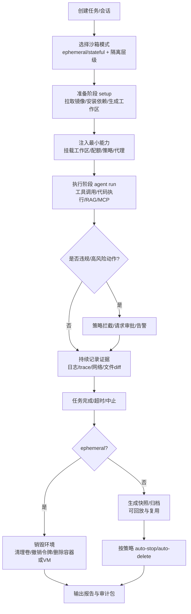
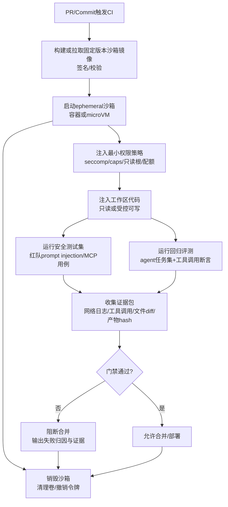

# 企业级 Agent 沙箱设计深度研究报告

## 执行摘要

企业级 agent（含代码执行能力、MCP/skill 集成、RAG 检索）一旦具备“可行动”的工具链，本质上就变成了一个**会被提示注入（prompt injection）操控的自动化执行体**：攻击者不需要拿到你的服务器权限，只要能影响 agent 的上下文（用户输入、RAG 检索内容、网页/仓库内容、依赖 README、MCP server 返回的资源等），就可能诱导其越权调用工具、下载恶意依赖、或把敏感数据外传。学术界已明确指出：检索与工具调用会模糊“数据 vs 指令”的边界，形成“间接提示注入（Indirect Prompt Injection）”等新的攻击面。citeturn2search1turn16view1

因此，沙箱设计的核心不是“能跑代码”，而是把 agent 的执行能力放入**可约束、可审计、可复现、可回收**的运行时中，并贯彻“默认不信任 + 最小权限 + 分层防御”的工程原则。OWASP 的 LLM Top 10 也将 Prompt Injection、Insecure Output Handling、Supply Chain Vulnerabilities、Model DoS 等列为关键风险类别，说明“安全边界与执行隔离”必须成为系统级构件，而不是事后补丁。citeturn2search0turn16view1

在隔离边界上，社区与高 star 项目已经形成较清晰的分层路径：  
- **容器沙箱**（Docker/K8s）：工程摩擦低，适合多数离线/CI 任务，但共享宿主内核，必须叠加 seccomp、capabilities、只读根文件系统等硬化控制。citeturn4search0turn4search1  
- **microVM 沙箱**（如 Firecracker、Docker Sandboxes）：把“硬边界”提升到虚拟化层，特别适合需要 Docker daemon/Compose 的 code agent；但要理解其资源开销与仍可能存在的跨层攻击研究。citeturn12view0turn2search7turn2search35  
- **OS 原语沙箱**（bubblewrap、macOS Seatbelt/sandbox-exec 等）：启动快、无需容器，但策略配置更“安全工程化”，并要求更强的可观测与策略治理（例如通过代理强制网络出入口）。citeturn11view1turn19view2turn11view2  
- **WASM 沙箱**（Wasmtime/WASI）：天然能力模型（capability-based），隔离强但能力受限，适用于“受控执行”与边缘/浏览器场景或高风险片段执行。citeturn3search3turn3search24

高 star 项目的落地实践显示：真正能规模化的沙箱体系通常具备“两阶段（setup vs agent）”与“凭证不入沙箱”的设计：例如 Codex 云任务默认 agent 阶段断网，setup 阶段可联网装依赖，并且云环境 secrets 仅在 setup 可用、在 agent 阶段移除；Docker Sandboxes 通过主机侧 HTTP/HTTPS 代理注入凭证，避免把 API key 存在沙箱内；Claude Code 的沙箱也通过代理与严格文件系统限制降低外泄风险。citeturn16view0turn18view0turn11view1

本报告给出一套可直接实施的企业级沙箱蓝图：用**隔离层级选择 + 权限/网络/文件系统/凭证策略 + 生命周期与证据保留 + CI/CD 自动化红队/回归**组成“闭环”，并以 DeerFlow/OpenHands/smolagents/E2B/Daytona 等的集成模式为参考，输出对比表、流程图、示例配置与分阶段落地清单。

## 假设与目标

### 默认假设与需定制维度

本报告在未收到进一步约束时，采用以下默认假设（你可据此标注差异并做定制）：

- 部署形态：同时考虑**开发机本地运行**与**CI/CD、测试环境**，生产可能为容器或 K8s（因为主流开源框架普遍提供 Docker/K8s 执行模式或远程 runtime）。citeturn8view0turn15view0  
- 语言与执行：默认以 **Python 为主要执行语言**（含 bash/脚本），并存在依赖安装/构建行为（典型 code agent 工作流）。citeturn15view0turn16view1  
- 能力组成：RAG 检索 + MCP/skill 工具调用 + 代码执行共存，因此需同时覆盖“内容注入、工具注入、依赖供应链、数据外泄”等复合风险。citeturn2search1turn5search0  
- 合规目标：需要**审计日志与证据保留**（谁在何时触发了什么工具调用/网络访问/文件写入），以支撑事后调查与合规。citeturn14view2turn19view0  

需进一步定制的关键维度包括：是否允许公网、是否允许访问内网、是否允许写入真实业务系统、是否允许 agent 持久化状态（stateful）、以及对数据分级（机密/敏感/公开）的处理策略。

### 沙箱体系的安全与工程目标

企业级沙箱的目标应明确为“**约束能力，而不是阻止智能**”，具体可落到八个设计目标：

- 机密性：限制 agent 读取与外发敏感数据（文件、凭证、私有仓库内容、数据库记录）。citeturn11view1turn16view1  
- 完整性：限制 agent 对非工作区、配置文件、VCS 元数据等的写入与篡改。citeturn16view0turn19view2  
- 可用性：防止资源耗尽（CPU/内存/磁盘爆炸）、无限循环、恶意依赖导致系统不稳定。citeturn2search0turn0search2  
- 可观测与可审计：对网络、文件、工具调用、违规访问进行结构化记录与告警。citeturn14view2turn19view0  
- 可复现：同一任务在相同输入与镜像/快照下可重复，适配评测与回归。citeturn15view1turn4search3  
- 可回收：任务结束可清理环境与凭证，避免残留风险。citeturn16view0turn18view0  
- 可集成：能作为“runtime provider”接入主流框架，并可嵌入 CI/CD 门禁。citeturn8view0turn15view0  
- 性能/成本可控：对不同风险等级任务选择不同隔离层级，避免“一刀切”高开销。citeturn12view0turn3search1  

## 威胁模型与安全目标

### 威胁模型分层

建议把威胁模型拆成三类“攻击者视角”，每类对应不同沙箱与策略重点：

- 内容注入型攻击者：能控制或影响 agent 输入上下文，包括用户输入、网页内容、RAG 检索文档、Issue/PR 描述、依赖 README 等。该类攻击可通过间接提示注入让 agent 把“数据”当“指令”，触发工具调用、数据外泄、甚至形成传播链。citeturn2search1turn16view1  
- 工具/集成型攻击者：通过 MCP server、skill、插件、第三方工具返回恶意 payload（例如诱导执行命令、请求更多权限、输出可执行代码片段），或利用“过度权限的 connector”达成越权与外泄。MCP 官方安全最佳实践将该类风险作为重点讨论对象。citeturn5search0turn5search30  
- 供应链/环境型攻击者：通过恶意依赖包、镜像污染、仓库内容污染、构建过程注入等方式植入后门。Codex 官方文档把“下载恶意/脆弱依赖、许可证污染”等作为开启网络访问的关键风险之一。citeturn16view1turn2search0  

### 常见攻击向量与沙箱应对要点

下表给出“企业级 agent 最常见的攻击向量—对应沙箱对策”的对齐方式（用于你后续做红队用例库与门禁指标）：

| 攻击向量 | 典型触发点 | 主要危害 | 沙箱/策略侧关键对策 |
|---|---|---|---|
| Prompt injection（直接/间接） | 网页、RAG 文档、Issue/PR、MCP 资源 | 越权工具调用、数据外泄、执行恶意命令 | 默认断网/白名单；工具调用前策略评估；输出校验；证据留存与告警 citeturn2search1turn16view1turn2search24 |
| 数据外泄（exfiltration） | 允许访问的第三方域名/API | 把仓库/文件/DB 内容上传到外部 | 代理出网 + allowlist（域名+方法）；阻断 POST/PUT 等高风险方法；对“广域名”做更细粒度 API 级策略 citeturn16view1turn14view3turn19view3 |
| 依赖/包管理供应链攻击 | pip/npm/apt 拉取 | 后门、RCE、持久化 | 网络域名收敛；依赖锁定与校验；镜像签名与 provenance；最小权限运行 citeturn16view1turn4search2turn4search19 |
| 越权本地资源访问 | 读 SSH key、docker.sock、宿主文件 | 直接控制宿主/集群、横向移动 | 文件系统 denylist/mandatory deny；禁用敏感 unix socket；避免挂载 docker.sock；必要时用 microVM/远程沙箱 citeturn19view3turn12view0turn15view0 |
| 资源耗尽 / Model DoS | 生成大文件、无限循环、fork bomb | 服务不可用、成本爆炸 | CPU/内存/磁盘/时间配额；auto-stop；限制并发；任务级 kill-switch citeturn2search0turn3search1turn0search2 |

## 隔离边界方案对比

### 隔离技术的主流选型逻辑

社区实践已趋于一致：隔离边界的“强弱”决定了你能给 agent 多大自治权。一个可操作的规则是：

- 只要 agent 能执行任意代码/命令，并且任务输入中包含不可信内容或需要联网安装依赖，就不要在宿主直跑。smolagents 也强调：本地执行 LLM 生成代码始终存在风险，“更强隔离”需要远程执行选项（如 E2B 或 Docker）。citeturn0search2turn0search6  
- 对需要 Docker daemon/Compose（构建镜像、起测试栈）的 agent，单纯“把 agent 放容器里”并不能解决“Docker 权限过大”的问题；因此 Docker Sandboxes 选择 microVM，每个沙箱有私有 Docker daemon，避免暴露宿主 daemon。citeturn12view0turn12view1  
- 对本地工具型 agent，如果你希望低开销且可细粒度限制文件/网络访问，OS 原语沙箱（bubblewrap/Seatbelt）是一个强选项。Anthropic 的 sandbox-runtime 就是为此而生：无需容器，通过 OS 原语与代理网络过滤实现限制，并用于 sandbox agents 与本地 MCP server。citeturn11view0turn11view1turn19view2  
- 对极高风险或强合规场景，WASM/WASI 的能力模型提供更“默认安全”的执行面，但要接受功能限制与生态差异。citeturn3search3turn3search24  

### 隔离边界与工具对比表

| 隔离边界 | 代表技术/项目 | 隔离强度与边界 | 优点 | 局限与陷阱 | 最适用场景 |
|---|---|---|---|---|---|
| 容器（Docker/K8s） | OpenHands Docker runtime、DeerFlow Docker sandbox | Linux namespaces/cgroups；共享宿主内核 | 生态成熟、易集成、成本低；可用 seccomp/capabilities 硬化 citeturn15view0turn8view0turn4search0 | 内核共享带来容器逃逸风险；错误挂载（如 docker.sock、HOME）会“直接破防” | 低到中风险代码执行、CI 任务、离线评测 |
| microVM | Firecracker、Docker Sandboxes | 虚拟化硬边界、独立内核 | 隔离更强；适合不可信代码与需要 Docker daemon 的 agent citeturn2search7turn12view0 | 资源开销更高；仍需关注跨层攻击研究与宿主补丁管理 citeturn2search27turn2search35 | 企业级 code agent、需要 Compose/容器编排的测试栈、多人并发 |
| OS 原语（无容器） | bubblewrap、macOS Seatbelt；Anthropic sandbox-runtime | mount/network namespace + Seatbelt policy + 代理出网 | 启动快、可细粒度文件/网络/Unix socket 控制；可做实时违规监测 citeturn11view1turn19view0turn11view2 | 策略难度高；配置错误会导致绕过；Linux 违规观测依赖 strace 等 citeturn19view0turn19view3 | 本地运行工具链、MCP server/脚本执行的轻量隔离、开发机安全强化 |
| WASM/WASI | Wasmtime；smolagents WebAssembly sandbox（Pyodide+Deno） | 默认沙箱化；通过 capability 显式开放资源 | 默认“能力最小化”；适合执行不可信片段与边缘环境 citeturn3search3turn0search6 | 受限于 WASI 能力与生态；整机/系统级操作能力不足 citeturn3search24turn3search32 | 高风险片段执行、浏览器/边缘侧 agent、严格合规的数据处理片段 |

## 最小权限与凭证管理

### 最小权限的落地抓手

在容器/Pod 场景，最小权限不是口号，而是由几个“强开关”组成：

- seccomp：Docker 默认 seccomp profile 采用“默认拒绝 + 白名单允许”的策略，禁用一批系统调用，并建议不要随意修改默认 profile。citeturn4search0  
- capabilities：Kubernetes 官方文档说明 capability 可把 root 权限拆分成离散能力，可通过 `securityContext.capabilities` 增删；实践上通常“drop ALL 再按需 add”。citeturn4search1turn4search8  
- 非 root 与禁止提权：至少启用 `runAsNonRoot`、`allowPrivilegeEscalation: false`、只读根文件系统（若适配），把写入集中到可控工作区卷。citeturn4search1turn4search25  

> 一个关键经验：不要为了“跑起来方便”把 seccomp 设为 unconfined 或使用 `--privileged`。类似 AIO Sandbox 示例中直接要求 `seccomp=unconfined` 的做法，在企业场景应视为高风险默认配置，需要额外隔离层或替代方案。citeturn10search14turn4search0

### 凭证管理的行业收敛方向：凭证不入沙箱

“凭证不入沙箱”正在成为高成熟度方案的共同点：

- Docker Sandboxes：通过主机侧 HTTP/HTTPS 代理对请求**透明注入** API key，使凭证留在宿主，沙箱内不存储凭证；删除沙箱后不留下凭证残留。citeturn18view0  
- Codex 云任务：采用两阶段模型，setup 阶段可联网装依赖；agent 阶段默认离线；并明确指出云环境 secrets **只在 setup 可用，agent 阶段前移除**。citeturn16view0turn16view1  
- Claude Code（云端/网页形态）：强调敏感凭证（git credentials、signing keys）不在沙箱中，通过代理服务处理 git 交互与鉴权，从而即便沙箱中代码被攻破也更难扩大危害。citeturn11view1  

在企业级 agent 里，“凭证不入沙箱”常见实现范式有三种（强烈建议至少采用一种）：

- 代理注入：在沙箱外部运行受控代理（HTTP 代理、git 代理、DB 代理），所有出网/出内网请求必须经代理；代理实现域名/方法/路径级策略、token 注入与审计。citeturn18view0turn11view1  
- 两阶段执行：setup 阶段注入短期 token 并完成依赖准备，agent 阶段撤销 token 并限制网络，仅允许必要通道。citeturn16view0turn16view1  
- 能力令牌化：为每个工具调用签发短期、最小 scope 的 token，并把“工具调用审批/策略”作为服务端网关责任（尤其适用于 MCP）。citeturn5search30turn5search0  

## 网络策略、文件系统与工作区挂载

### 网络策略：默认断网、代理出入口、白名单化

高成熟度文档对“agent 网络”的立场非常一致：默认应限制网络，必要时收敛到 allowlist，并尽量限制 HTTP 方法。

- Codex：明确说明 agent 阶段默认断网；开启网络会带来 prompt injection、外泄、恶意依赖、许可证污染等风险；并建议仅允许必要域名与 HTTP 方法，甚至建议只允许 `GET/HEAD/OPTIONS`。citeturn16view1turn16view0  
- Docker Sandboxes：网络通过 HTTP/HTTPS 过滤代理；并提供 allowlist/denylist 两种模式，其中 denylist 模式“默认阻断全部，只放行指定目的地”，适用于生产与 CI。citeturn14view0turn14view3  
- Anthropic sandbox-runtime：通过 HTTP 与 SOCKS5 代理强制所有网络流量走受控出入口；WARNING 指出“仅域名 allowlist 不检查内容”，广域名（如 `github.com`）仍可能成为外泄通道，且可能存在域名前置等绕过风险。citeturn19view2turn19view3  

一个可落地的企业默认策略是：  
- 生产与 CI：denylist 模式（默认断网）+ 精简 allowlist（模型 API、依赖源、企业内部允许的 artifact 仓库）+ 禁止除 GET/HEAD 外的方法（除非明确需要）。citeturn16view1turn14view0  
- 开发与调试：allowlist 模式（默认允许）+ 阻断所有私网 CIDR、localhost、云元数据服务 + 用网络日志观察真实访问面后再逐步收敛。Docker Sandboxes 默认就阻断私网/loopback/link-local/metadata 类网段。citeturn14view3turn14view2  

### 文件系统策略：工作区可写，其他只读或不可见

主流框架在文件系统上也高度收敛：给 agent 一个可写工作区，其余区域应显式限制。

- DeerFlow：提供本地执行与 Docker/K8s sandbox，多数生产建议使用 Docker sandbox；其文档示例将 uploads/workspace/outputs 放在沙箱内固定路径。citeturn8view0turn6view1  
- OpenHands：Docker runtime 每个 session 创建并管理一个容器；Local runtime 直跑宿主且**明确提示无隔离**，仅适合开发测试。citeturn15view0  
- Codex CLI：默认 workspace-write 模式写权限限制在工作区，并对 `.git`、`.codex` 等路径做“受保护只读”，降低篡改与持久化风险。citeturn16view0  
- sandbox-runtime：写权限默认全拒绝，必须显式 allow；并提供“mandatory deny paths”自动保护（如 shell 配置、git hooks、IDE 目录等），同时警示过宽写权限可能导致提权或跨上下文执行。citeturn19view2turn19view3  

### Unix socket 与“隐形后门”

很多团队在 agent 沙箱里最容易忽略的是 unix socket：允许访问某些 socket 等价于开放了“高权限后门”。sandbox-runtime 明确指出：如果允许访问 `/var/run/docker.sock`，基本等同于获得宿主控制权，应极度谨慎。citeturn19view3turn12view0  

对需要容器编排能力的 agent，优先选择“私有 daemon”的设计（例如 microVM 中独立 Docker daemon），而不是把宿主 docker.sock 挂进去。Docker Sandboxes 正是以此为动机：避免 agent 看到宿主容器与镜像。citeturn12view0turn12view1  

## 生命周期管理、可复现与可观测审计

### 生命周期：ephemeral 与 stateful 的权衡

企业级 agent 常同时需要两种生命周期：

- Ephemeral（一次性、可丢弃）：适用于 CI、评测、红队回归——任务结束即销毁环境，降低残留风险。Daytona 明确支持 Ephemeral Sandboxes（停止即删除）；bubblewrap 的设计也强调 mount namespace root 在 tmpfs、进程退出即清理的特征。citeturn3search30turn11view2  
- Stateful（可暂停/恢复/快照）：适用于长链路任务（研究、迁移、重构），需要缓存依赖、保留中间产物、支持断点续跑。Docker Sandboxes 的沙箱可持久存在直至显式删除；Daytona 默认 15 分钟无活动 auto-stop，并提供 archive/auto-delete 等策略配置。citeturn12view2turn3search1turn3search30  

建议用“风险等级”驱动生命周期策略：高风险输入（公网内容、未知仓库、第三方 MCP）默认 ephemeral；可信输入或内部任务可 stateful 以换取效率。

### 可复现：镜像、依赖与供应链可验证

可复现不仅是工程效率，也是安全与审计的基础：事故发生后你要能“复放”当时的环境与证据。建议将以下纳入沙箱体系的“构建与发布门禁”：

- 镜像/产物签名：Sigstore Cosign 支持对容器镜像进行（含 keyless）签名与验证，可作为运行前准入条件。citeturn4search2turn4search18  
- 供应链 provenance：SLSA 将 provenance 定义为可验证的“构建来源与过程信息”，并提供等级化要求；对企业 agent 的 sandbox 镜像尤其关键。citeturn4search19turn4search7  

### 可观测与审计：不仅要“日志”，还要“证据”

企业审计通常需要回答：**谁/何时/为什么触发了什么行为**。沙箱观测建议至少覆盖：

- 网络访问证据：域名、端口、允许/阻断、匹配到的策略规则、次数与最近访问。Docker Sandboxes 提供聚合网络日志（allowed/blocked）。citeturn14view2turn14view3  
- 违规访问证据：受限文件/网络/Unix socket 的访问尝试与 EPERM 记录。sandbox-runtime 在 macOS 可通过系统 violation log store 实时监测；Linux 侧可用 strace 辅助定位。citeturn19view0turn19view0  
- 工具调用与文件改动：对每次 tool-call 记录输入/输出摘要、文件写入路径、diff/产物哈希（便于回放与取证）。OpenHands 的 runtime 设计把执行动作与观测（observations）通过事件流组织，是一种可参考的工程化骨架。citeturn15view0  

### sandbox 生命周期流程图



## 与主流框架与工具栈集成实践

### DeerFlow：多模式 sandbox provider（本地/Docker/K8s）

DeerFlow 文档明确提供多种 sandbox execution mode：本地执行（host）、Docker 容器隔离，以及通过 provisioner 在本机集群中以 K8s Pod 运行。其配置示例将 sandbox provider 写成可替换组件（LocalSandboxProvider / AioSandboxProvider）。citeturn8view0turn6view1  

工程启示：把“沙箱”做成可插拔 provider，框架负责 orchestration（任务状态、工具路由、审计抽象），具体隔离与生命周期交给 provider。

### OpenHands：Runtime 抽象 + 多后端（Docker/Remote/Modal/Runloop）

OpenHands 的 runtime 设计把环境执行统一为 Runtime 接口，并通过 action_execution_server 执行 bash、IPython、文件与浏览器动作；其实现包含 Docker（每 session 一个容器）、Remote（远程环境）、以及云执行后端等。并明确警告 Local runtime 无隔离。citeturn15view0  

工程启示：对企业来说，“Remote runtime + 强隔离沙箱”能较好支撑大规模评测（其文档提到 Remote runtime 常用于并行评测，如 SWE-Bench）。citeturn15view0  

### smolagents：执行后端可插拔（Docker/E2B/Modal/WASM）

smolagents 明确提供多种安全执行选项，包含 E2B、Docker、以及 WebAssembly（Pyodide+Deno）等，并强调远程/隔离执行是运行不可信代码的关键路径。citeturn0search6turn0search2  

工程启示：对“只需要安全执行代码片段”的企业 agent，可以把执行层抽离为“executor 服务”，避免把整个 agent 主控逻辑都放进高成本隔离边界。

### E2B 与 Daytona：远程沙箱基础设施

- E2B 文档将其定位为“isolated sandboxes”，用于安全执行代码、处理数据与运行工具，并提供 SDK 管理环境。citeturn3search0turn17search3  
- Daytona 文档强调 sandbox 的 auto-stop、ephemeral、以及通过 SDK 创建/管理沙箱的生命周期能力（默认 15 分钟无活动自动停止，可关闭）。citeturn3search1turn3search30  

工程启示：当你的 agent 要处理高风险输入、或需要跨团队共享执行环境时，“托管/远程沙箱”能显著降低本地逃逸与凭证外泄风险，但需要额外的网络/数据通道设计（尤其是内网数据访问与审计）。

### LangGraph 的关系：沙箱之外的“可回放状态”

LangGraph 的 checkpoint/persistence 机制通过 `thread_id` 与 `checkpoint_id` 获取与回放状态快照，是“可复现/可回放”体系的另一半：沙箱保证执行隔离，checkpoint 保证流程可恢复与可追溯。citeturn1search2turn1search11  

### CI/CD 集成流程图



> 关键门禁建议：在 CI 中至少做“策略不被突破”的验证（例如禁止访问内网 CIDR、禁止写入受保护路径、禁止获取宿主凭证），并把证据包作为构建产物保存，以便复盘与合规抽查。citeturn14view3turn19view0turn16view0  

## 示例实现与配置片段

下面给出四类隔离边界的“最小可用模板”，便于你快速落地 PoC。示例为通用模板，需按你的业务工具与环境调整。

### Docker 容器沙箱示例

**最小化 Dockerfile（只演示原则：非 root、固定依赖、最小工具）**

```dockerfile
FROM python:3.11-slim

# 基本安全习惯：创建非root用户
RUN useradd -m -u 10001 agent && mkdir -p /workspace /outputs && chown -R agent:agent /workspace /outputs
USER agent

WORKDIR /workspace

# 可选：在构建期安装固定版本依赖（推荐用 lockfile / hashes）
# COPY requirements.txt .
# RUN pip install --no-cache-dir -r requirements.txt

ENV PYTHONDONTWRITEBYTECODE=1 \
    PYTHONUNBUFFERED=1

CMD ["python", "-c", "print('sandbox ready')"]
```

配套运行参数（示意）：  
- 工作区挂载到 `/workspace`（必要时只读）  
- 限制 CPU/内存/进程数/文件句柄  
- `--cap-drop=ALL` + 需要时再加回  
- `--security-opt no-new-privileges`  
- 自定义或默认 seccomp profile（不要 unconfined）  

这些硬化手段的原理与收益在 Docker seccomp 文档与 K8s SecurityContext 文档中都有明确说明。citeturn4search0turn4search1  

### microVM（以 Firecracker 思路为代表）的工程要点

microVM 通常不直接在业务侧“手写 Firecracker API”，而是通过平台或产品形态（例如 Docker Sandboxes、托管沙箱服务）提供封装。Docker Sandboxes 的架构说明了其关键点：每个沙箱是 microVM，内部有私有 Docker daemon，工作区通过同步而非宿主挂载，并通过 host 侧代理进行网络控制与凭证注入。citeturn12view0turn18view0  

如果你要自建 microVM 平台（或评估供应商），建议在评审清单中显式纳入：  
- 虚拟化边界与宿主补丁策略（Firecracker 生产建议强调依赖 KVM 与宿主/微码补丁）。citeturn2search27turn2search7  
- 资源隔离与监控（host-level limits/cgroup），以及异常 guest 行为的处理。citeturn2search38  
- 已知研究风险：microVM-based containers 仍可能遭受跨层攻击与性能降级研究，避免把“microVM”当绝对安全。citeturn2search35  

### bubblewrap 命令示例（Linux OS 原语沙箱）

bubblewrap 的核心是“新 mount namespace + 可控 bind mounts + 可选 network namespace + seccomp”。其仓库文档明确支持 mount、PID、network namespace 与 seccomp，并强调 bind 进来的东西可能带来提权面。citeturn11view2turn2search10  

一个简化示例（只允许读 `/usr`、读写工作区、关闭网络）：

```bash
bwrap \
  --ro-bind /usr /usr \
  --proc /proc \
  --dev /dev \
  --unshare-pid \
  --unshare-net \
  --new-session \
  --bind "$PWD" /workspace \
  --chdir /workspace \
  bash -lc 'python -c "print(\"hello\")"'
```

> 企业落地时，建议结合：文件系统“写入 allowlist”、敏感路径强制 deny、以及对网络的“只能走代理”的策略（参照 sandbox-runtime 的设计）。citeturn19view2turn11view1  

### WASM runner 伪码（能力模型执行）

WASM/WASI 典型思路是：默认不给文件/网络/环境变量，必须显式授予能力。Wasmtime 安全文档强调 WebAssembly 的“天然沙箱属性”（内存隔离、必须 import 才能访问外部能力），并讨论不同策略的取舍；Azure 的 WASI 资料也强调默认无法访问宿主资源，除非显式允许，并以 capability model 提供资源访问。citeturn3search3turn3search24  

伪码示意（概念化）：

```python
def run_wasm(module_bytes, stdin_text, allowed_dirs=None, allowed_env=None):
    """
    概念示例：创建 Wasm 实例时显式授予能力
    - allowed_dirs: 允许读写的目录（映射到 WASI preopen）
    - allowed_env: 允许的环境变量白名单
    """
    store = WasmStore()
    wasi = WasiConfig()

    for d in (allowed_dirs or []):
        wasi.preopen_dir(host_path=d, guest_path=d, read=True, write=True)

    for k, v in (allowed_env or {}).items():
        wasi.env(k, v)

    wasi.stdin(stdin_text)
    # 默认不提供 sockets/network capability（除非你显式装配）
    instance = WasmInstance(store, module_bytes, wasi=wasi)
    return instance.call("main")
```

## 测试与评估方法、常见陷阱与落地路线

### 测试与评估：把“沙箱安全性”变成可回归指标

建议把沙箱测试分为三层，形成自动化回归：

- 策略单测（Policy unit tests）：验证“禁止项确实被禁止、允许项确实可用”。例如：  
  - 读 `~/.ssh` 必须失败；写 `.git/hooks` 必须失败；访问被阻断 CIDR 必须失败。  
  sandbox-runtime 提供了明确的 deny/allow 优先级与 mandatory deny 机制，可直接转化为单测用例。citeturn19view2turn19view3  

- 红队用例（Adversarial/Red-team）：围绕 OWASP LLM Top 10 与间接提示注入研究构造任务，例如“让 agent 修复某 issue，但 issue 中隐藏 exfil 命令”。Codex 文档给出了非常具体的 prompt injection 外泄示例，可作为红队模板。citeturn16view1turn2search0turn2search1  

- 端到端回归（E2E regression）：对你的代表性 agent 任务集（RAG/MCP/代码执行）做重复运行，检查：  
  - 功能是否达成（任务通过率）  
  - 安全门禁是否触发（违规次数、阻断网络请求数、审批次数）  
  - 成本与延迟（启动时间、依赖缓存命中、沙箱资源耗用）  
  网络日志与违规监测是让“安全回归”可度量的关键数据源。citeturn14view2turn19view0  

### 常见陷阱与缓解建议

- 把“Docker 运行”误当“已沙箱化”：若挂载宿主 HOME、或暴露 docker.sock、或给 privileged/unconfined seccomp，隔离形同虚设。citeturn19view3turn4search0  
- 允许宽泛域名导致“合规型外泄”：即使做了域名 allowlist，允许 `github.com` 仍可能形成外泄通道；官方文档明确提示此类风险，并提及 domain fronting 等绕过可能。citeturn14view3turn19view3  
- Linux OS 原语沙箱缺乏原生违规可视化：bubblewrap 本身不提供统一 violation log，需要你补 strace/审计管道，否则“看不见失败原因”会导致策略逐步放宽，最终失去意义。citeturn19view0turn11view2  
- “Local runtime/host execution”被误用于生产：OpenHands 直接警告 local runtime 无隔离；DeerFlow 也在最佳实践中建议生产使用 Docker sandbox。citeturn15view0turn8view0  
- 只做执行隔离，不做输入治理：间接提示注入研究显示，RAG 与工具调用会引入新型攻击面；沙箱是必要不充分条件，还需输出校验与工具调用策略门禁。citeturn2search1turn2search24turn5search0  

### 可操作实施步骤与时间估计

以下路线以“先可用、再变强、最后规模化”为原则，优先保证你能在一个月内把沙箱变成 CI 门禁的一部分。

| 优先级 | 交付物 | 关键动作 | 预计时间 |
|---|---|---|---|
| P0 | 最小可用沙箱（MVP） | 选定隔离边界（容器或远程）；工作区挂载策略；默认断网或严格 allowlist；CPU/内存/超时限制；输出网络与文件日志 | 1–2 周 |
| P0 | 凭证不入沙箱 | 采用代理注入或两阶段执行；把 secrets 从 agent 运行时剥离；建立最小 scope token 与轮换策略 | 1–2 周 |
| P1 | 策略单测与红队用例库 v1 | 把“禁止项”做成自动化测试；加入 prompt injection/exfil 基本用例；将网络阻断与违规计数纳入 CI 报告 | 1–2 周 |
| P1 | 供应链门禁 | 镜像签名与验证（Cosign）；依赖锁定与校验；建立可追溯 provenance（SLSA） | 2–4 周 |
| P2 | 状态与回放能力 | 将任务执行与 LangGraph checkpoint（或等价机制）打通，形成“可复现证据包” | 2–4 周 |
| P2 | 分级隔离策略 | 根据任务风险分层：低风险容器、高风险 microVM/远程沙箱；建立策略路由与审批机制 | 3–6 周 |

### 推荐的下一步行动清单

- 先做一次“输入面盘点”：把 agent 的上下文来源列清（用户输入、RAG 文档、网页 fetch、MCP 资源、依赖下载），并按“可信/不可信/可被污染”分级，作为沙箱策略的输入。citeturn2search1turn5search0  
- 选一条最短路径落地：  
  - 若你已有 Docker/K8s：先用容器沙箱 + seccomp/capabilities/只读根 + denylist 网络策略起步。citeturn4search0turn4search1turn14view0  
  - 若你需要强隔离且 agent 要跑 Docker：评估 microVM（例如 Docker Sandboxes 模式或 Firecracker 系）。citeturn12view0turn2search7  
  - 若你要低开销本地隔离：评估 sandbox-runtime（OS 原语 + 代理强制网络）并做策略单测。citeturn11view0turn19view0  
- 把“沙箱违规”做成可量化 KPI：违规次数、被阻断网络请求数、被阻断写入次数、审批触发次数、以及最终任务成功率与成本。citeturn14view2turn19view0  

### 优先阅读链接（官方/原始来源优先）

- Docker Sandboxes 架构与设计动机（microVM、私有 Docker daemon、凭证注入、生命周期）citeturn12view0turn18view0  
- Docker Sandboxes 网络策略（代理出网、默认阻断私网、allowlist/denylist、网络日志）citeturn14view3turn14view2turn14view0  
- Anthropic sandbox-runtime（OS 原语沙箱、网络/文件/Unix socket 限制、违规监测、限制说明）citeturn11view0turn19view2turn19view3turn19view0  
- Anthropic Claude Code 的沙箱架构说明（文件+网络隔离、代理出网、凭证隔离）citeturn11view1  
- OpenAI Codex：安全与审批、两阶段执行、默认断网与受保护路径等（企业级运行建议）citeturn16view0turn16view1  
- OWASP LLM Top 10 与 Prompt Injection 防护清单（风险分类与对策框架）citeturn2search0turn2search24  
- 间接提示注入原始论文（RAG/工具调用场景的核心威胁论证）citeturn2search1  
- DeerFlow sandbox 配置与模式（local/docker/k8s provider 思路）citeturn8view0turn6view1  
- OpenHands Runtime（Docker/Remote/Local runtime 的隔离差异与架构）citeturn15view0turn15view1  
- smolagents 安全执行（E2B/Docker/WASM 执行后端）citeturn0search2turn0search6  
- MCP 官方安全最佳实践与授权指南（从协议视角做工具安全治理）citeturn5search0turn5search30turn5search4