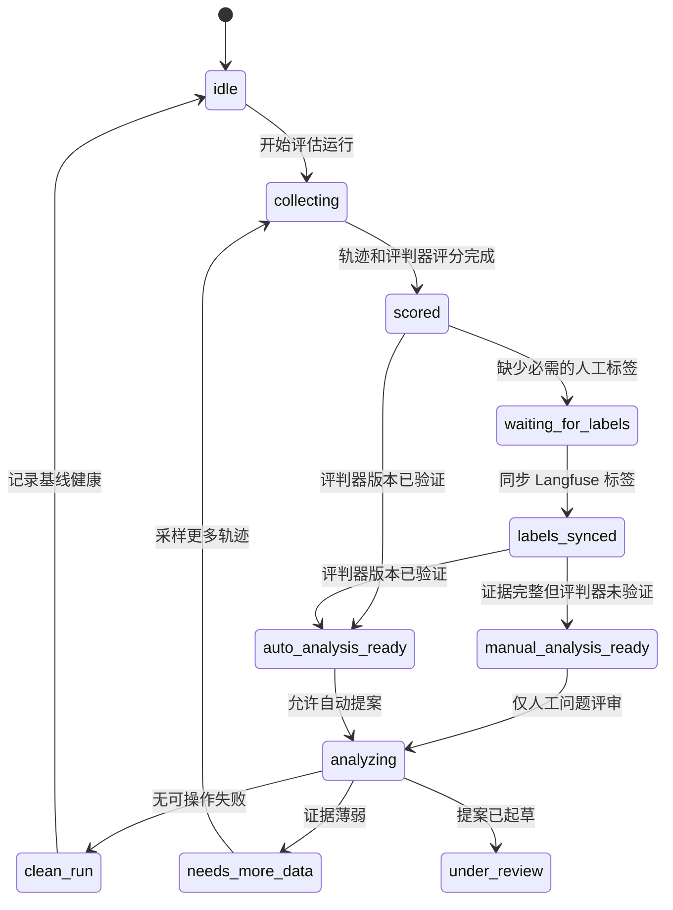
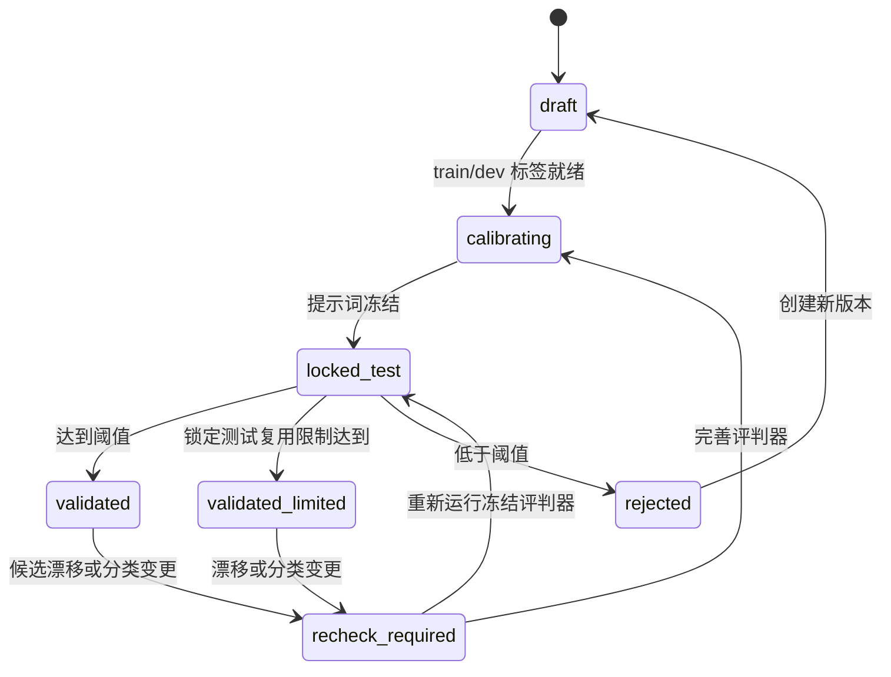
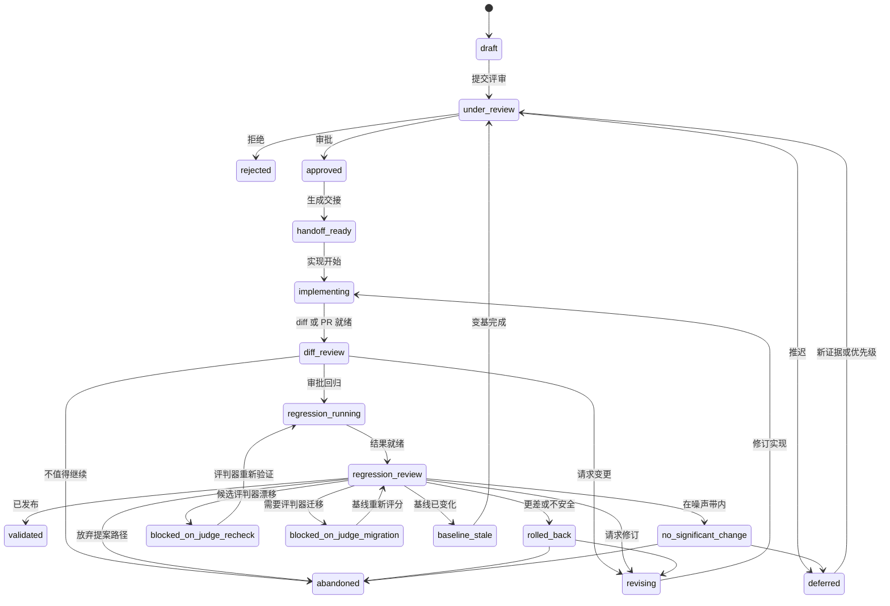
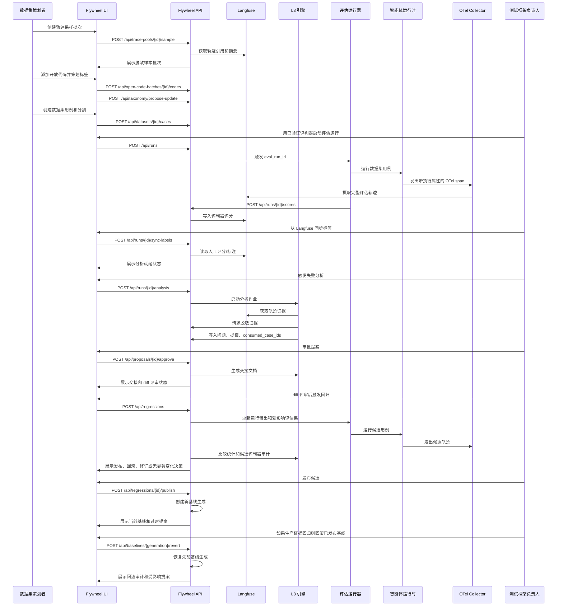

# Flywheel UI/UX 设计规格

**日期**: 2026-06-22  
**状态**: 修订草案  
**父规格**: `docs/superpowers/specs/2026-06-22-flywheel-engine-design.md`

---

## 1. 目标

Flywheel UI 是飞轮中 Langfuse 不拥有部分的人工控制界面：数据/错误分析工作流、分类治理、评判器版本验证、失败问题评审、改进提案审批、移交跟踪和回归发布/回滚决策。

UI 不应在 MVP 中克隆 Langfuse 轨迹浏览或标注。MVP 应深度链接到 Langfuse 进行原始轨迹检查，并在足够时使用 Langfuse 原生评分/标注。Flywheel UI 导入或同步这些标签，专注于将证据转化为受控测试框架变更的循环状态。

---

## 2. 产品原则

1. **控制优于奇观**: 清晰展示状态、证据和可用动作。
2. **证据先于动作**: 每个审批/拒绝/发布决策必须展示轨迹、用例、标签、评判器有效性、留出完整性和回归增量。
3. **数据优先，标准其次**: 分类和数据集通过评审从真实轨迹中涌现。
4. **不克隆 Langfuse**: 在可能的情况下复用 Langfuse 进行深度轨迹检查和原生标注。
5. **不隐藏自动化**: LLM 生成的标签、根因和提案必须展示来源、版本和置信度。
6. **噪声是一种状态**: 无显著变化不同于胜利或失败。

---

## 3. 用户与任务

| 用户 | 任务 |
|---|---|
| 测试框架负责人 | 审批提案、评审回归、发布或回滚候选、审批发布后基线回滚。 |
| 数据集策划者 | 采样轨迹、开放编码失败、策划数据集用例、维护 train/dev/locked-test 分割。 |
| 评判器负责人 | 验证评判器版本、检查不一致、审批任务家族的评判器使用。 |
| 平台维护者 | 配置项目、集成、角色、脱敏策略和幂等性/审计设置。 |

---

## 4. 前端技术栈

| 层级 | 选择 | 原因 |
|---|---|---|
| 应用运行时 | React + TypeScript + Vite | 轻量级内部应用，快速本地迭代。 |
| 路由 | React Router | 显式的运行、数据集、评判器、问题、提案和回归路由。 |
| 服务端状态 | TanStack Query | 缓存 API 读取，处理变更失效和重试状态。 |
| 表格 | TanStack Table | 密集的可排序/可过滤数据策划、问题和回归表格。 |
| UI 原语 | shadcn/ui 或等效本地组件 | 无障碍、克制的内部工具组件。 |
| 图标 | lucide-react | 熟悉的审批、拒绝、推迟、打开轨迹、重跑、发布图标。 |
| 图表 | Recharts 或轻量 SVG 包装器 | 小型校准、置信区间和指标增量视图。 |
| 测试 | Vitest + Testing Library + Playwright | 交互和浏览器级工作流检查。 |

必须在刷新后存活的状态存储在 Flywheel API/状态存储中。

---

## 5. 后端边界

浏览器仅与 Flywheel API 通信。它绝不接收 Langfuse 写凭证。

```
浏览器 UI -> Flywheel API -> 状态存储
                         |-> Langfuse API（轨迹链接、评分读取、评分写入）
                         |-> L3 引擎作业（分析/提案/回归）
                         |-> RedactionService（证据显示前）
```

Flywheel UI 中展示的原始轨迹载荷必须通过脱敏流水线。对于完整的轨迹检查，UI 链接到 Langfuse。

---

## 6. 信息架构

### MVP 路由

| 路由 | 用途 |
|---|---|
| `/runs` | 按项目、数据集、测试框架指纹、状态和决策状态列出评估运行。 |
| `/runs/:runId` | 运行概览：评分、同步标签、分析状态、问题、提案、回归链接。 |
| `/data/trace-pools` | 可用于采样和开放编码的轨迹池。 |
| `/data/open-coding/:batchId` | 开放代码、候选标签、合并/拆分/退役决策。 |
| `/data/datasets/:datasetId` | 数据集用例、源轨迹、分割完整性、标签平衡。 |
| `/taxonomy` | 带示例和反例的版本化失败标签注册表。 |
| `/judges` | 评判器版本、任务家族、验证状态、锁定测试指标。 |
| `/judges/:judgeVersion` | 校准报告、不一致、少数标签精确率/召回率、复检状态。 |
| `/baselines` | 当前基线、血缘、产生提案、回滚历史和过时的进行中提案。 |
| `/issues` | 跨运行的失败问题列表。 |
| `/issues/:issueId` | 问题证据、根因、受影响用例、提案。 |
| `/proposals/:proposalId` | 提案评审、已消费证据、提议变更、移交状态。 |
| `/regressions/:regressionId` | 基线 vs 候选比较、留出证明、候选审计、决策。 |
| `/settings` | 项目、集成、角色、脱敏策略、采样预算。 |

### 阶段 2 路由

| 路由 | 用途 |
|---|---|
| `/annotations` | 仅在 Langfuse 原生标注不足时的自定义标注队列。 |
| `/handoffs` | 编码智能体执行历史和 PR/diff 链接。 |
| `/costs` | 详细评估成本和延迟分析。 |

---

## 7. 宏观状态模型

Flywheel 有三个相关的状态机。将它们分离可以避免之前的运行级校准陷阱。

提案和回归状态使用引擎规格中的权威 snake_case 值。

### 运行状态



### 评判器版本状态



### 提案和回归状态



---

## 8. 前端交互序列



---

## 9. 页面设计

### 运行列表

核心问题："哪个运行需要决策？"

列：

- 运行 ID
- 项目
- 数据集版本
- 测试框架指纹
- 评判器版本
- 状态
- 带置信区间的通过率
- 标签同步状态
- 开放问题
- 决策状态
- 创建时间

`judge F1` 仅在运行引用已验证评判器报告时显示。早期或未标记运行显示 `不可用`，而非误导性的零。

### 数据与错误分析

核心问题："轨迹中实际出现了什么失败？"

视图：

- 轨迹采样批次
- 开放代码
- 候选标签聚类
- 标签合并/拆分/退役控制
- 数据集用例创建
- 分割平衡和少数标签覆盖
- 任务家族覆盖和混合家族警告

动作：

- 采样轨迹
- 添加开放代码
- 将重复的 `other` 聚类提升为候选标签
- 创建数据集用例
- 分配分割
- 分配任务家族
- 审批分类版本

### 分类

核心问题："每个失败标签意味着什么？"

展示：

- 标签 slug 和父级
- 定义
- 示例和反例
- 状态：候选、活跃、退役
- 别名和迁移历史
- 仍使用旧分类版本的数据集和标注
- 首次出现和最后出现
- 链接的问题和数据集

### 评判器版本

核心问题："此评判器能否用于此任务家族？"

展示：

- 评判器版本、模型、提示词版本、分类版本
- train/dev/locked-test 数据集
- 整体 F1 和每标签精确率/召回率
- 混淆矩阵
- 评审者间一致性（可用时）
- 验证阈值和结果
- 候选漂移后的复检状态

动作：

- 冻结提示词用于测试
- 标记已验证
- 标记已拒绝
- 请求复检

### 基线

核心问题："当前测试框架基线是什么，它来自哪里，能否安全回滚？"

展示：

- 当前生成和测试框架指纹
- 产生提案和发布决策
- 先前生成和血缘链
- 状态：当前、已取代或已回滚
- 此生成导致的过时进行中提案
- 生产漂移、事件或在线回归证据
- 回滚原因和审计历史

动作：

- 检查产生提案
- 检查回归报告
- 请求发布后回滚
- 确认回滚到先前生成
- 打开过时提案进行变基

### 失败问题

核心问题："哪些重复失败可操作？"

展示：

- 问题标题
- 分类标签和开放代码
- 受影响用例
- 证据计数
- 脱敏状态
- 脱敏覆盖率和过屏蔽警告
- 根因假设
- 置信度和反例
- 链接的提案

### 提案评审

核心问题："此变更是否有理由、安全且有边界？"

展示：

- 链接的问题
- 提议的变更
- 证据轨迹 ID
- 已消费用例 ID
- 留出影响警告
- 预期指标增量
- 风险级别
- 回滚计划
- 生成的交接 Markdown

动作：

- 审批
- 拒绝并附原因
- 推迟
- 请求修订
- 生成交接
- 链接 PR/diff

### 回归评审

核心问题："此候选能否成为新基线？"

展示：

- 基线 vs 候选指纹
- 用于评分基线和候选的评判器版本
- 带置信区间的通过率增量
- 预期 vs 实际指标增量
- 独立留出假设计数、原始回归运行计数和多重比较调整
- 每标签增量
- 修复的失败
- 新失败
- 无显著变化标记
- 留出完整性证明
- 候选人工审计一致性
- 基线过时或目标文件冲突警告
- 成本和延迟增量

动作：

- 发布候选
- 回滚候选
- 标记无显著变化
- 请求修订
- 要求评判器复检
- 要求评判器迁移
- 要求提案变基
- 放弃提案路径

---

## 10. UI API 接口

### 读取

| 端点 | 用途 |
|---|---|
| `GET /api/projects` | 项目选择器和授权上下文。 |
| `GET /api/runs` | 带过滤器的运行列表。 |
| `GET /api/runs/{run_id}` | 运行概览。 |
| `GET /api/trace-pools` | 轨迹池和采样历史。 |
| `GET /api/open-code-batches/{batch_id}` | 开放编码批次详情。 |
| `GET /api/datasets/{dataset_id}` | 数据集用例和分割完整性。 |
| `GET /api/taxonomy` | 当前和历史分类版本。 |
| `GET /api/judges` | 评判器版本和验证状态。 |
| `GET /api/judges/{judge_version}` | 校准报告。 |
| `GET /api/baselines` | 列出项目基线、当前生成、血缘和回滚状态。 |
| `GET /api/baselines/{generation}` | 检查一个基线生成和产生提案。 |
| `GET /api/issues` | 失败问题列表。 |
| `GET /api/issues/{issue_id}` | 问题详情。 |
| `GET /api/proposals/{proposal_id}` | 提案评审详情。 |
| `GET /api/regressions/{regression_id}` | 回归结果详情。 |
| `GET /api/redaction/reports` | 脱敏覆盖率和过屏蔽报告。 |

### 变更

| 端点 | 用途 |
|---|---|
| `POST /api/trace-pools/{pool_id}/sample` | 创建代表性样本批次。 |
| `POST /api/open-code-batches/{batch_id}/codes` | 添加或更新开放代码。 |
| `POST /api/taxonomy/propose-update` | 合并、拆分、提升、退役或重命名标签。 |
| `POST /api/datasets/{dataset_id}/cases` | 从轨迹创建数据集用例。 |
| `POST /api/judges` | 创建评判器版本。 |
| `POST /api/judges/{judge_version}/validate` | 运行或记录锁定测试验证。 |
| `POST /api/baselines/{generation}/revert` | 人工门控的发布后回滚到先前基线生成。 |
| `POST /api/runs` | 启动评估运行。 |
| `POST /api/runs/{run_id}/scores` | L1 提交评判器/规则评分。 |
| `POST /api/runs/{run_id}/sync-labels` | 从 Langfuse 重新同步人工标签；可安全重复运行。 |
| `POST /api/runs/{run_id}/analysis` | 启动失败分析。 |
| `POST /api/proposals/{proposal_id}/approve` | 人工审批门控。 |
| `POST /api/proposals/{proposal_id}/reject` | 拒绝提案。 |
| `POST /api/proposals/{proposal_id}/defer` | 推迟提案。 |
| `POST /api/proposals/{proposal_id}/handoff` | 生成编码智能体交接。 |
| `POST /api/proposals/{proposal_id}/implementation-link` | 附加 PR 或 diff 链接。 |
| `POST /api/regressions` | 触发回归运行。 |
| `POST /api/regressions/{regression_id}/publish` | 晋升候选测试框架。 |
| `POST /api/regressions/{regression_id}/rollback` | 拒绝候选测试框架。 |
| `POST /api/regressions/{regression_id}/no-significant-change` | 记录噪声带结果。 |
| `POST /api/regressions/{regression_id}/require-judge-recheck` | 阻止发布直到评判器重新验证。 |
| `POST /api/regressions/{regression_id}/resume-after-judge-recheck` | 评判器验证后将阻塞候选返回回归运行。 |
| `POST /api/regressions/{regression_id}/require-judge-migration` | 阻止发布直到基线用候选评判器版本重新评分。 |
| `POST /api/regressions/{regression_id}/resume-after-judge-migration` | 基线重新评分后将阻塞候选返回回归评审。 |
| `POST /api/proposals/{proposal_id}/rebase` | 将过时提案变基到当前基线。 |

所有变更返回更新后的对象和仅追加的审计事件 ID。

---

## 11. 授权与幂等性

### 角色

| 角色 | 允许的高风险动作 |
|---|---|
| 数据集策划者 | 采样、开放编码、数据集用例创建、分类提案。 |
| 评判器负责人 | 评判器验证和复检决策。 |
| 测试框架负责人 | 提案审批、回归发布、回滚、放弃、发布后回滚。 |
| 平台维护者 | 项目设置、脱敏策略、角色分配。 |

发布、回滚、发布后回滚、脱敏策略变更和提案审批需要显式角色检查。

### 幂等性

变更 UI 动作必须包含幂等键。重复提交应返回现有的结果对象，而非创建重复的运行、标签、提案或决策。

标签同步是从 Langfuse 的可重复导入，非一次性转换。运行必须在分析前定义标签法定人数和超时策略：

- 法定人数：所需的最低人工标签或评审失败数
- 超时：运行可使用部分标签继续的时间点
- 重新同步：后期 Langfuse 标签可更新运行，如果实质性则标记分析过时

---

## 12. 核心数据形状

```ts
type RunState =
  | "idle"
  | "collecting"
  | "scored"
  | "waiting_for_labels"
  | "labels_synced"
  | "manual_analysis_ready"
  | "auto_analysis_ready"
  | "analyzing"
  | "clean_run"
  | "needs_more_data"
  | "under_review";

type JudgeState =
  | "draft"
  | "calibrating"
  | "locked_test"
  | "validated"
  | "validated_limited"
  | "rejected"
  | "recheck_required";

type ProposalState =
  | "draft"
  | "under_review"
  | "rejected"
  | "deferred"
  | "approved"
  | "handoff_ready"
  | "implementing"
  | "diff_review"
  | "revising"
  | "regression_running"
  | "regression_review"
  | "blocked_on_judge_recheck"
  | "blocked_on_judge_migration"
  | "baseline_stale"
  | "validated"
  | "rolled_back"
  | "no_significant_change"
  | "abandoned";

type RegressionStatus =
  | "not_started"
  | "running"
  | "waiting_for_judge_recheck"
  | "waiting_for_judge_migration"
  | "ready_for_review"
  | "complete";

type RegressionOutcome =
  | "published"
  | "rolled_back"
  | "no_significant_change"
  | "revise"
  | "abandoned"
  | "judge_recheck_required"
  | "judge_migration_required"
  | "baseline_stale";

type Baseline = {
  project: string;
  generation: number;
  fingerprint: string;
  producedByProposalId?: string;
  previousGeneration?: number;
  publishedAt: string;
  status: "current" | "superseded" | "reverted";
  revertReason?: string;
  revertedAt?: string;
};

type TaxonomyLabel = {
  slug: string;
  parent?: string;
  definition: string;
  examples: string[];
  counterexamples: string[];
  status: "candidate" | "active" | "retired";
};

type ProposalReview = {
  proposalId: string;
  runId: string;
  state: ProposalState;
  regressionStatus?: RegressionStatus;
  regressionOutcome?: RegressionOutcome;
  baselineGeneration: number;
  baselineFingerprint: string;
  candidateHypothesisId?: string;
  riskLevel: "low" | "medium" | "high";
  issueIds: string[];
  consumedCaseIds: string[];
  evidenceTraceIds: string[];
  expectedMetricDelta: Record<string, number>;
  rollbackPlan: string;
};
```

`RegressionStatus` 派生自 `ProposalState`，不应独立持久化。合法派生：

| ProposalState | RegressionStatus |
|---|---|
| `draft` 到 `diff_review` | `not_started` |
| `regression_running` | `running` |
| `blocked_on_judge_recheck` | `waiting_for_judge_recheck` |
| `blocked_on_judge_migration` | `waiting_for_judge_migration` |
| `regression_review` | `ready_for_review` |
| `validated`、`rolled_back`、`no_significant_change`、`abandoned` | `complete` |
| `baseline_stale`、`revising`、`deferred`、`rejected` | 省略 `regressionStatus` |

---

## 13. 错误、空状态和安全状态

| 状态 | UI 行为 |
|---|---|
| 无轨迹池 | 展示集成设置和采样动作。 |
| 无分类标签 | 开始开放编码批次而非手动创建标签。 |
| Langfuse 中轨迹缺失 | 保持证据引用可见，标记为不可用，允许重新获取。 |
| 脱敏阻止 | 隐藏证据并阻止分析/提案使用。 |
| 评判器未验证 | 禁用自动分析并展示评判器验证路由。 |
| 锁定测试泄露 | 阻止发布并展示已消费/留出交集。 |
| 候选评判器漂移 | 阻止发布并路由到评判器复检。 |
| 基线过时 | 阻止回归发布并路由提案进行变基。 |
| 冷回归留出耗尽 | 阻止基线晋升，除非记录了经审计的手动实验性发布。 |
| 增量在噪声带内 | 提供无显著变化、修订或放弃选项，而非发布。 |
| 评分写入失败 | 展示可重试的变更错误；保留本地表单状态。 |
| 未授权动作 | 解释所需角色，不暴露秘密或策略内部。 |

---

## 14. 视觉设计方向

使用安静的内部工具界面：

- 中性背景
- 高对比度文本
- 紧凑表格
- 用于证据摘要和决策的稳定分割面板
- 语义状态颜色：红色表示失败/回归/阻塞，绿色表示已验证/已发布，琥珀色表示评审/推迟/噪声，蓝色表示运行中
- 带工具提示的图标按钮用于重复动作
- 卡片仅用于重复项目或框架工具
- 无营销英雄、装饰渐变或超大面板

设计应优化重复评审工作：扫描、比较、决策、移至下一项。

---

## 15. MVP 验收标准

1. 策划者可以采样轨迹、添加开放代码和提升候选分类标签。
2. 策划者可以创建带任务家族和 train/dev/locked-test 或 regression-holdout 分割的数据集用例。
3. 评判器负责人可以检查带显式阈值和每标签指标的评判器版本验证报告。
4. 运行可以引用已验证的评判器版本并从 Langfuse 同步人工标签。
5. 引擎可以将失败问题发布到 Flywheel UI，附带脱敏证据链接。
6. 提案展示已消费用例、证据轨迹、风险、回滚计划，并可以审批/拒绝/推迟。
7. 回归评审展示置信区间、留出完整性证明、候选审计结果和无显著变化状态。
8. 发布和回滚需要测试框架负责人授权。
9. 浏览器绝不接收 Langfuse 写凭证。

---

## 16. 前端验证

MVP 前端工作应包括：

- 路由 schema 和授权失败的 API 契约测试。
- 分类更新、评判器验证、提案评审和回归决策表单的组件测试。
- 主控制循环的 Playwright 测试：采样轨迹 -> 策划数据集 -> 验证评判器 -> 运行评估 -> 同步标签 -> 分析 -> 审批提案 -> 评审回归。
- 桌面和窄视口表格/详情布局的视觉检查。
- 评分写入、标签同步、分析作业、回归触发和发布授权的变更失败测试。

---

## 17. 非目标

- 替代 Langfuse 轨迹可视化。
- MVP 中替代 Langfuse 标注。
- 构建通用 BI 仪表盘。
- 全自动审批或发布。
- 多租户 SaaS 管理。
- 移动优先标注工作流。
