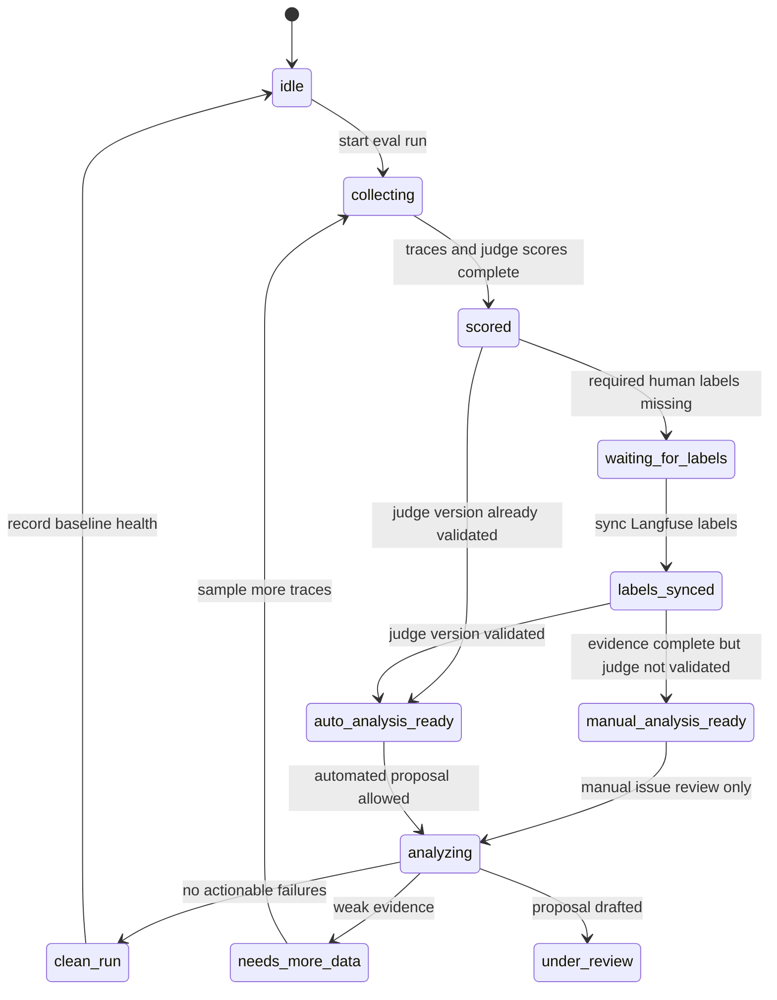
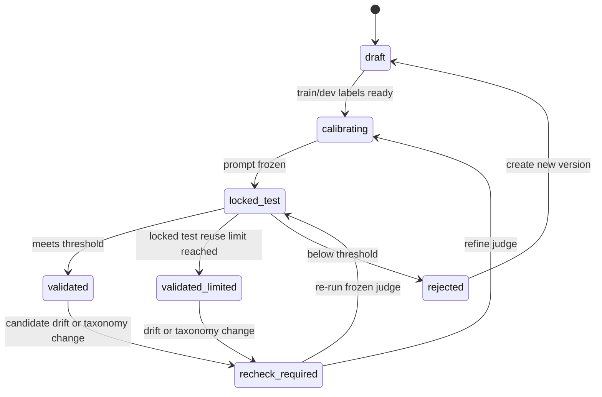
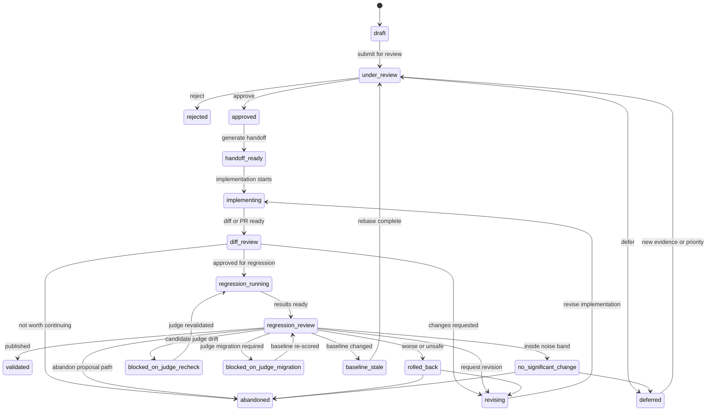
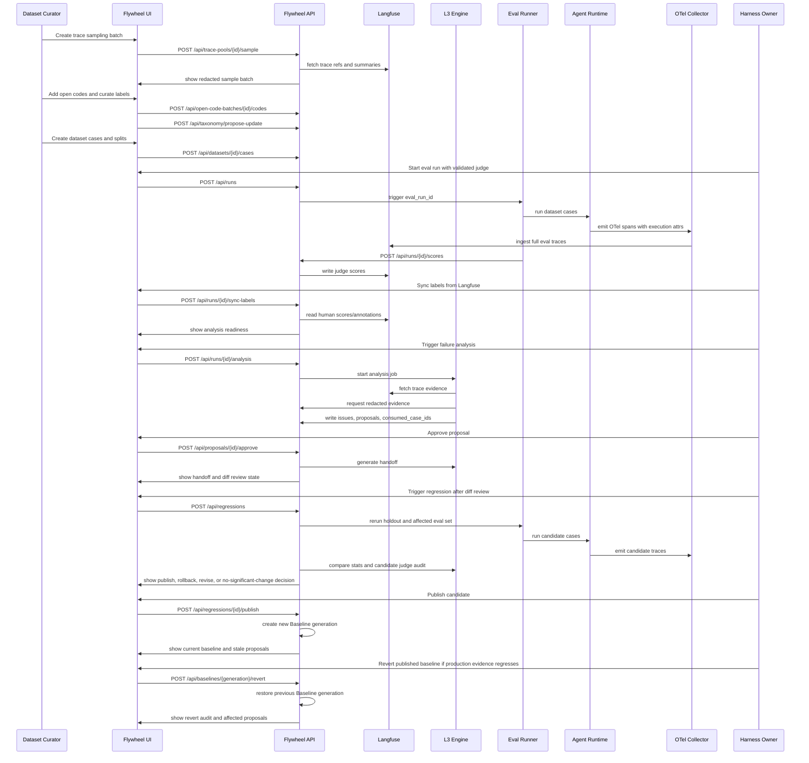

# Flywheel UI/UX Design Spec
**Date**: 2026-06-22
**Status**: Revised Draft
**Parent Spec**: `docs/superpowers/specs/2026-06-22-flywheel-engine-design.md`

---

## 1. Goal

Flywheel UI is the human control surface for the parts of the loop that Langfuse does not own: data/error analysis workflow, taxonomy governance, judge-version validation, failure issue review, improvement proposal approval, handoff tracking, and regression publish/rollback decisions.

The UI should not clone Langfuse trace browsing or annotation as an MVP requirement. MVP should deep-link into Langfuse for raw trace inspection and use Langfuse native scoring/annotation where it is sufficient. Flywheel UI imports or syncs those labels and focuses on the loop state that turns evidence into controlled harness changes.

---

## 2. Product Principles

1. **Control over spectacle**: show state, evidence, and available actions clearly.
2. **Evidence before action**: every approve/reject/publish decision must show traces, cases, labels, judge validity, holdout integrity, and regression deltas.
3. **Data first, criteria second**: taxonomy and datasets emerge from real traces through review.
4. **Do not clone Langfuse**: reuse Langfuse for deep trace inspection and native annotation when possible.
5. **No hidden automation**: LLM-generated labels, root causes, and proposals must show source, version, and confidence.
6. **Noise is a state**: no-significant-change is different from win or loss.

---

## 3. Users and Jobs

| User | Jobs |
|---|---|
| Harness owner | Approve proposals, review regressions, publish or roll back candidates, and approve post-publish baseline reverts. |
| Dataset curator | Sample traces, open-code failures, curate dataset cases, maintain train/dev/locked-test splits. |
| Judge owner | Validate judge versions, inspect disagreements, approve judge use for task families. |
| Platform maintainer | Configure projects, integrations, roles, redaction policies, and idempotency/audit settings. |

---

## 4. Frontend Stack

| Layer | Choice | Reason |
|---|---|---|
| App runtime | React + TypeScript + Vite | Lightweight internal app with fast local iteration. |
| Routing | React Router | Explicit run, dataset, judge, issue, proposal, and regression routes. |
| Server state | TanStack Query | Cache API reads, handle mutation invalidation and retry states. |
| Tables | TanStack Table | Dense sortable/filterable data curation, issue, and regression tables. |
| UI primitives | shadcn/ui or equivalent local components | Accessible, restrained internal-tool components. |
| Icons | lucide-react | Familiar approve, reject, defer, open trace, rerun, publish icons. |
| Charts | Recharts or lightweight SVG wrappers | Small calibration, confidence interval, and metric delta views. |
| Testing | Vitest + Testing Library + Playwright | Interaction and browser-level workflow checks. |

State that must survive refresh lives in Flywheel API/State Store.

---

## 5. Backend Boundary

The browser talks only to Flywheel API. It never receives Langfuse write credentials.

```
Browser UI -> Flywheel API -> State Store
                         |-> Langfuse API for trace links, score reads, score writes
                         |-> L3 Engine jobs for analysis/proposal/regression
                         |-> RedactionService before evidence display
```

Raw trace payloads shown in Flywheel UI must pass through the redaction pipeline. For full trace inspection, the UI links to Langfuse.

---

## 6. Information Architecture

### MVP Routes

| Route | Purpose |
|---|---|
| `/runs` | Eval runs by project, dataset, harness fingerprint, state, and decision status. |
| `/runs/:runId` | Run overview: scoring, synced labels, analysis status, issues, proposals, regression links. |
| `/data/trace-pools` | Trace pools available for sampling and open coding. |
| `/data/open-coding/:batchId` | Open codes, candidate labels, merge/split/retire decisions. |
| `/data/datasets/:datasetId` | Dataset cases, source traces, split integrity, label balance. |
| `/taxonomy` | Versioned failure-label registry with examples and counterexamples. |
| `/judges` | Judge versions, task families, validation status, locked-test metrics. |
| `/judges/:judgeVersion` | Calibration report, disagreements, minority-label precision/recall, recheck status. |
| `/baselines` | Current baseline, lineage, producing proposals, revert history, and stale in-flight proposals. |
| `/issues` | Failure issue list across runs. |
| `/issues/:issueId` | Issue evidence, root cause, affected cases, proposals. |
| `/proposals/:proposalId` | Proposal review, consumed evidence, proposed changes, handoff state. |
| `/regressions/:regressionId` | Baseline vs candidate comparison, holdout proof, candidate audit, decision. |
| `/settings` | Projects, integrations, roles, redaction policies, sampling budgets. |

### Phase 2 Routes

| Route | Purpose |
|---|---|
| `/annotations` | Custom annotation queue only if Langfuse native annotation is insufficient. |
| `/handoffs` | Coding-agent execution history and PR/diff linking. |
| `/costs` | Detailed eval cost and latency analysis. |

---

## 7. Macro State Models

Flywheel has three related state machines. Keeping them separate avoids the previous run-level calibration trap.
The proposal and regression states use the authoritative snake_case values from the engine spec.

### Run State



### Judge Version State



### Proposal and Regression State



---

## 8. Frontend Interaction Sequence



---

## 9. Page Designs

### Runs

Primary question: "Which run needs a decision?"

Columns:

- run id
- project
- dataset version
- harness fingerprint
- judge version
- state
- pass rate with confidence interval
- labels synced
- open issues
- decision status
- created at

`judge F1` should appear only when the run references a validated judge report. Early or unlabeled runs show `not available`, not a misleading zero.

### Data and Error Analysis

Primary question: "What failures are actually appearing in traces?"

Views:

- trace sampling batch
- open codes
- candidate label clusters
- label merge/split/retire controls
- dataset case creation
- split balance and minority-label coverage
- task-family coverage and mixed-family warnings

Actions:

- sample traces
- add open code
- promote repeated `other` cluster to candidate label
- create dataset case
- assign split
- assign task family
- approve taxonomy version

### Taxonomy

Primary question: "What does each failure label mean?"

Show:

- label slug and parent
- definition
- examples and counterexamples
- status: candidate, active, retired
- aliases and migration history
- datasets and annotations still using older taxonomy versions
- first seen and last seen
- linked issues and datasets

### Judge Versions

Primary question: "Can this judge be used for this task family?"

Show:

- judge version, model, prompt version, taxonomy version
- train/dev/locked-test datasets
- overall F1 and per-label precision/recall
- confusion matrix
- inter-annotator agreement if available
- validation threshold and result
- recheck status after candidate drift

Actions:

- lock prompt for test
- mark validated
- mark rejected
- request recheck

### Baselines

Primary question: "What harness baseline is current, where did it come from, and can it be safely reverted?"

Show:

- current generation and harness fingerprint
- producing proposal and publish decision
- previous generation and lineage chain
- status: current, superseded, or reverted
- stale in-flight proposals caused by this generation
- production drift, incident, or online regression evidence
- revert reason and audit history

Actions:

- inspect producing proposal
- inspect regression report
- request post-publish revert
- confirm revert to previous generation
- open stale proposals for rebase

### Failure Issues

Primary question: "What repeated failures are actionable?"

Show:

- issue title
- taxonomy labels and open codes
- affected cases
- evidence count
- redaction status
- redaction coverage and over-block warnings
- root cause hypothesis
- confidence and counterexamples
- linked proposals

### Proposal Review

Primary question: "Is this change justified, safe, and bounded?"

Show:

- linked issues
- proposed changes
- evidence trace ids
- consumed case ids
- holdout impact warning
- expected metric delta
- risk level
- rollback plan
- generated handoff Markdown

Actions:

- approve
- reject with reason
- defer
- request revision
- generate handoff
- link PR/diff

### Regression Review

Primary question: "Can this candidate become the new baseline?"

Show:

- baseline vs candidate fingerprints
- judge version used to score both baseline and candidate
- pass rate delta with confidence interval
- expected vs actual metric delta
- distinct holdout hypothesis count, raw regression run count, and multiple-comparison adjustment
- per-label deltas
- fixed failures
- new failures
- no-significant-change marker
- holdout integrity proof
- candidate human audit agreement
- baseline stale or target-file conflict warnings
- cost and latency deltas

Actions:

- publish candidate
- rollback candidate
- mark no significant change
- request revision
- require judge recheck
- require judge migration
- require proposal rebase
- abandon proposal path

---

## 10. API Surface for UI

### Reads

| Endpoint | Purpose |
|---|---|
| `GET /api/projects` | Project selector and authz context. |
| `GET /api/runs` | Runs list with filters. |
| `GET /api/runs/{run_id}` | Run overview. |
| `GET /api/trace-pools` | Trace pools and sampling history. |
| `GET /api/open-code-batches/{batch_id}` | Open coding batch detail. |
| `GET /api/datasets/{dataset_id}` | Dataset cases and split integrity. |
| `GET /api/taxonomy` | Current and historical taxonomy versions. |
| `GET /api/judges` | Judge versions and validation states. |
| `GET /api/judges/{judge_version}` | Calibration report. |
| `GET /api/baselines` | List project baselines, current generation, lineage, and revert state. |
| `GET /api/baselines/{generation}` | Inspect one baseline generation and producing proposal. |
| `GET /api/issues` | Failure issue list. |
| `GET /api/issues/{issue_id}` | Issue detail. |
| `GET /api/proposals/{proposal_id}` | Proposal review detail. |
| `GET /api/regressions/{regression_id}` | Regression result detail. |
| `GET /api/redaction/reports` | Redaction coverage and over-block reports. |

### Mutations

| Endpoint | Purpose |
|---|---|
| `POST /api/trace-pools/{pool_id}/sample` | Create representative sample batch. |
| `POST /api/open-code-batches/{batch_id}/codes` | Add or update open codes. |
| `POST /api/taxonomy/propose-update` | Merge, split, promote, retire, or rename labels. |
| `POST /api/datasets/{dataset_id}/cases` | Create dataset cases from traces. |
| `POST /api/judges` | Create judge version. |
| `POST /api/judges/{judge_version}/validate` | Run or record locked-test validation. |
| `POST /api/baselines/{generation}/revert` | Human-gated post-publish revert to a previous baseline generation. |
| `POST /api/runs` | Start eval run. |
| `POST /api/runs/{run_id}/scores` | L1 submits judge/rule scores. |
| `POST /api/runs/{run_id}/sync-labels` | Re-sync human labels from Langfuse; safe to run repeatedly. |
| `POST /api/runs/{run_id}/analysis` | Start failure analysis. |
| `POST /api/proposals/{proposal_id}/approve` | Human approval gate. |
| `POST /api/proposals/{proposal_id}/reject` | Reject proposal. |
| `POST /api/proposals/{proposal_id}/defer` | Defer proposal. |
| `POST /api/proposals/{proposal_id}/handoff` | Generate coding-agent handoff. |
| `POST /api/proposals/{proposal_id}/implementation-link` | Attach PR or diff link. |
| `POST /api/regressions` | Trigger regression run. |
| `POST /api/regressions/{regression_id}/publish` | Promote candidate harness. |
| `POST /api/regressions/{regression_id}/rollback` | Reject candidate harness. |
| `POST /api/regressions/{regression_id}/no-significant-change` | Record noise-band result. |
| `POST /api/regressions/{regression_id}/require-judge-recheck` | Block publish until judge is revalidated. |
| `POST /api/regressions/{regression_id}/resume-after-judge-recheck` | Return blocked candidate to regression running after judge validation. |
| `POST /api/regressions/{regression_id}/require-judge-migration` | Block publish until baseline is re-scored with the candidate judge version. |
| `POST /api/regressions/{regression_id}/resume-after-judge-migration` | Return blocked candidate to regression review after baseline re-scoring. |
| `POST /api/proposals/{proposal_id}/rebase` | Rebase stale proposal onto current baseline. |

All mutations return the updated object and an append-only audit event id.

---

## 11. Authorization and Idempotency

### Roles

| Role | Allowed high-risk actions |
|---|---|
| Dataset curator | Sampling, open coding, dataset case creation, taxonomy proposals. |
| Judge owner | Judge validation and recheck decisions. |
| Harness owner | Proposal approval, regression publish, rollback, abandon, post-publish revert. |
| Platform maintainer | Project settings, redaction policy, role assignment. |

Publish, rollback, post-publish revert, redaction policy changes, and proposal approval require explicit role checks.

### Idempotency

Mutating UI actions must include idempotency keys. Duplicate submits should return the existing resulting object, not create duplicate runs, labels, proposals, or decisions.

Label sync is a repeatable import from Langfuse, not a one-time transition. Runs must define a label quorum and timeout policy before analysis:

- quorum: minimum human labels or reviewed failures required
- timeout: when a run may proceed with partial labels
- re-sync: late Langfuse labels can update the run and, if material, mark analysis stale

---

## 12. Core Data Shapes

```ts
type RunState =
  | "idle"
  | "collecting"
  | "scored"
  | "waiting_for_labels"
  | "labels_synced"
  | "manual_analysis_ready"
  | "auto_analysis_ready"
  | "analyzing"
  | "clean_run"
  | "needs_more_data"
  | "under_review";

type JudgeState =
  | "draft"
  | "calibrating"
  | "locked_test"
  | "validated"
  | "validated_limited"
  | "rejected"
  | "recheck_required";

type ProposalState =
  | "draft"
  | "under_review"
  | "rejected"
  | "deferred"
  | "approved"
  | "handoff_ready"
  | "implementing"
  | "diff_review"
  | "revising"
  | "regression_running"
  | "regression_review"
  | "blocked_on_judge_recheck"
  | "blocked_on_judge_migration"
  | "baseline_stale"
  | "validated"
  | "rolled_back"
  | "no_significant_change"
  | "abandoned";

type RegressionStatus =
  | "not_started"
  | "running"
  | "waiting_for_judge_recheck"
  | "waiting_for_judge_migration"
  | "ready_for_review"
  | "complete";

type RegressionOutcome =
  | "published"
  | "rolled_back"
  | "no_significant_change"
  | "revise"
  | "abandoned"
  | "judge_recheck_required"
  | "judge_migration_required"
  | "baseline_stale";

type Baseline = {
  project: string;
  generation: number;
  fingerprint: string;
  producedByProposalId?: string;
  previousGeneration?: number;
  publishedAt: string;
  status: "current" | "superseded" | "reverted";
  revertReason?: string;
  revertedAt?: string;
};

type TaxonomyLabel = {
  slug: string;
  parent?: string;
  definition: string;
  examples: string[];
  counterexamples: string[];
  status: "candidate" | "active" | "retired";
};

type ProposalReview = {
  proposalId: string;
  runId: string;
  state: ProposalState;
  regressionStatus?: RegressionStatus;
  regressionOutcome?: RegressionOutcome;
  baselineGeneration: number;
  baselineFingerprint: string;
  candidateHypothesisId?: string;
  riskLevel: "low" | "medium" | "high";
  issueIds: string[];
  consumedCaseIds: string[];
  evidenceTraceIds: string[];
  expectedMetricDelta: Record<string, number>;
  rollbackPlan: string;
};
```

`RegressionStatus` is derived from `ProposalState` and should not be independently persisted. Legal derivation:

| ProposalState | RegressionStatus |
|---|---|
| `draft` through `diff_review` | `not_started` |
| `regression_running` | `running` |
| `blocked_on_judge_recheck` | `waiting_for_judge_recheck` |
| `blocked_on_judge_migration` | `waiting_for_judge_migration` |
| `regression_review` | `ready_for_review` |
| `validated`, `rolled_back`, `no_significant_change`, `abandoned` | `complete` |
| `baseline_stale`, `revising`, `deferred`, `rejected` | omit `regressionStatus` |

---

## 13. Error, Empty, and Safety States

| State | UI behavior |
|---|---|
| No trace pools | Show integration setup and sampling action. |
| No taxonomy labels | Start open-coding batch rather than creating labels manually. |
| Trace missing from Langfuse | Keep evidence ref visible, mark unavailable, allow refetch. |
| Redaction blocked | Hide evidence and block analysis/proposal use. |
| Judge not validated | Disable automated analysis and show judge validation route. |
| Locked-test leakage | Block publish and show consumed/holdout intersection. |
| Candidate judge drift | Block publish and route to judge recheck. |
| Baseline stale | Block regression publish and route proposal to rebase. |
| Cold regression holdout exhausted | Block baseline promotion unless an audited manual experimental release is recorded. |
| Delta inside noise band | Offer no-significant-change, revise, or abandon, not publish. |
| Score write failed | Show retryable mutation error; preserve local form state. |
| Unauthorized action | Explain required role without exposing secrets or policy internals. |

---

## 14. Visual Design Direction

Use a quiet internal-tool interface:

- neutral background
- high-contrast text
- compact tables
- stable split panes for evidence summaries and decisions
- semantic status colors: red for failed/regressed/blocked, green for validated/published, amber for review/deferred/noisy, blue for running
- icon buttons with tooltips for repeated actions
- cards only for repeated items or framed tools
- no marketing hero, decorative gradients, or oversized panels

The design should optimize for repeated review work: scan, compare, decide, move to next item.

---

## 15. MVP Acceptance Criteria

1. A curator can sample traces, add open codes, and promote candidate taxonomy labels.
2. A curator can create dataset cases with task family and train/dev/locked-test or regression-holdout splits.
3. A judge owner can inspect a judge-version validation report with explicit thresholds and per-label metrics.
4. A run can reference a validated judge version and sync human labels from Langfuse.
5. The engine can publish failure issues into Flywheel UI with redacted evidence links.
6. A proposal shows consumed cases, evidence traces, risk, rollback plan, and can be approved/rejected/deferred.
7. Regression review shows confidence intervals, holdout integrity proof, candidate audit result, and no-significant-change state.
8. Publish and rollback require harness-owner authorization.
9. The browser never receives Langfuse write credentials.

---

## 16. Frontend Verification

MVP frontend work should include:

- API contract tests for route schemas and authorization failures.
- component tests for taxonomy update, judge validation, proposal review, and regression decision forms.
- Playwright tests for the main control loop: sample traces -> curate dataset -> validate judge -> run eval -> sync labels -> analyze -> approve proposal -> review regression.
- visual checks for desktop and narrow viewport table/detail layouts.
- mutation failure tests for score write, label sync, analysis job, regression trigger, and publish authorization.

---

## 17. Non-Goals

- Replacing Langfuse trace visualization.
- Replacing Langfuse annotation in MVP.
- Building a general BI dashboard.
- Fully automatic approval or publish.
- Multi-tenant SaaS administration.
- Mobile-first annotation workflow.
